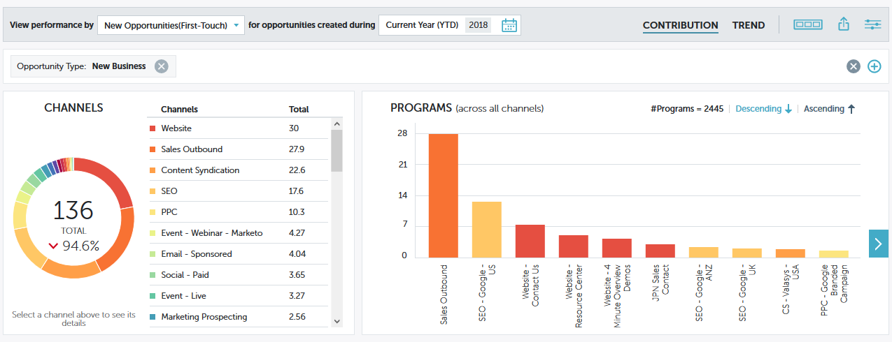

# [!UICONTROL Informations sur les performances] [!UICONTROL graphiques rapides] {#performance-insights-quick-charts}

Les [!UICONTROL graphiques rapides] sont des miniatures que vous personnalisez et enregistrez pour obtenir un aperçu rapide des graphiques que vous utilisez le plus.

## Créer un graphique rapide {#create-a-new-quick-chart}

[!UICONTROL Graphiques rapides] dériver des données que vous spécifiez. Dans cet exemple, nous choisirons : **nouvelles opportunités (première touche), type d’opportunité = nouvelle entreprise, cumul annuel actuel**.

1. Cliquez sur le filtre de date et choisissez **[!UICONTROL Année en cours (YTD)]**.

   

1. Cliquez sur le **+** et sélectionnez vos critères.

   

1. Le graphique est mis à jour pour refléter les filtres que vous avez choisis.

   

1. Cliquez sur l’icône Exporter et sélectionnez **[!UICONTROL Enregistrer en tant que graphique rapide]**.

   

1. Nommez votre graphique rapide et cliquez sur **[!UICONTROL Enregistrer]**.

   

Votre graphique rapide est maintenant avec les autres.

>[!NOTE]
>
>Vous pouvez avoir jusqu&#39;à 20 graphiques rapides. Ils peuvent être supprimés et remplacés.

## Afficher les graphiques rapides existants {#view-existing-quick-charts}

1. Pour afficher vos graphiques rapides existants, cliquez simplement sur l’icône **[!UICONTROL Graphiques rapides]**.

   

## Supprimer un graphique rapide {#delete-a-quick-chart}

Si vous devez supprimer un graphique rapide, procédez comme suit.

1. Cliquez sur l’icône **[!UICONTROL Graphiques rapides]**.

   

1. Pointez sur le graphique souhaité, mais ne cliquez pas dessus. Au survol, un X s’affiche. Cliquez sur le **X**.

   

1. Cliquez sur **[!UICONTROL Supprimer]**.

   
