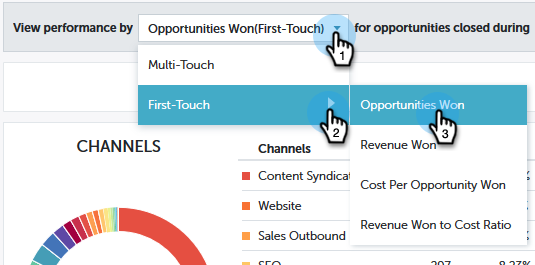

# [!UICONTROL Performances Insights] Tendance Overview {#performance-insights-trend-overview}

[!UICONTROL Tendance] affiche les performances du canal sur une période donnée.

Cliquez sur l&#39;onglet **[!UICONTROL Tendance]** pour accéder à cette vue.

## [!UICONTROL tendance] {#trend}

Sélectionnez la mesure en fonction de laquelle vous souhaitez afficher les performances.

Les mesures sont présentées sous la forme de deux graphiques : en anneau et en ligne.

Le graphique en anneau affiche les dix premiers canaux de la mesure que vous avez sélectionnée.

Le graphique en courbes affiche la tendance des performances du canal pour la mesure que vous avez sélectionnée au cours des 12 derniers mois.

Sélectionnez un ou plusieurs canaux et le graphique en courbes affiche la tendance du canal. Cliquez à nouveau sur le ou les canaux pour les désélectionner.

La grille de données ci-dessous fonctionne comme une feuille de calcul, affichant toutes les données de tendance disponibles pour la mesure que vous avez sélectionnée au cours des 12 derniers mois.

Développez un canal pour afficher ses dix meilleurs programmes, en combinant les autres programmes.

>[!NOTE]
>
>Cliquez sur la case à cocher en regard d’un canal pour l’activer/désactiver dans le graphique en anneau.
