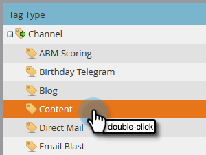

# Configuration des statistiques de performances {#setting-up-performance-insights}

Suivez les étapes ci-dessous pour configurer MPI.

## Configuration de l&#39;opportunité {#opportunity-setup}

1. Cliquez sur **Admin**.

   

1. Cliquez sur **Recettes Cycle Analytics**.

   

   >[!NOTE]
   >
   >Si vous n’avez pas d’autorité de certification, vous devez sélectionner Analyse **** Programme pour l’étape 2.

1. Sous Attribution, cliquez sur **Modifier**.

   

1. Les paramètres d’attribution s’affichent.

   

   Si l’attribution est explicite, assurez-vous que le rôle de contact d’opportunité a été renseigné (via le point de terminaison du rôle d’opportunité ou via l’intégration CRM).

   Si l&#39;attribution est implicite, assurez-vous que le champ de société de l&#39;prospect/contact est identique à celui du nom du compte de l&#39;opportunité.

   >[!NOTE]
   >
   >Assurez-vous que les champs appropriés sont renseignés pour toutes les opportunités :
   >
   >    
   >    
   >    * Montant de l&#39;opportunité
   >    * Est fermé
   >    * Est gagné
   >    * Date de création (peut ne pas être définie dans votre cas)
   >    * Date de fermeture (cette option peut ne pas être définie dans votre cas)
   >    * Type d&#39;opportunité

## Configuration du programme {#program-setup}

Mettez à jour les coûts du programme pendant au moins 12 mois. Vous pouvez effectuer cette opération manuellement ou à l’aide de l’API de programme. Dans cet exemple, nous le faisons manuellement.

1. Cliquez sur Activités **** marketing.

   

1. Recherchez et sélectionnez votre programme.

   

1. Cliquez sur l’onglet **Configuration** .

   

1. Faites glisser le coût **** de la période sur le canevas.

   

1. Définissez le mois du Programme pour il y a au moins 12 mois et cliquez sur **Ok**.

   

1. Définissez le coût de la période et cliquez sur **Enregistrer**.

   

Ensuite, passez en revue le comportement des analyses pour indiquer si un canal particulier doit être inclus dans les analyses. Définissez le comportement d’Analytics (normal, inclusif, opérationnel).

1. Cliquez sur **Admin**.

   

1. Cliquez sur **Balises**.

   

1. Cliquez sur le **+** pour développer la liste de Canal.

   

1. Doublon-cliquez sur le canal de votre choix.

   

1. Cliquez sur la liste déroulante Comportement **** Analytics et sélectionnez le comportement de votre choix.

   

1. Définissez les critères de réussite.

   

1. Cliquez sur **Enregistrer**.

   

## Lier le Programme à la personne {#tie-the-program-to-the-person}

1. Assurez-vous que le Programme d’acquisition et la date d’acquisition ont été définis pour chaque personne de votre base de données afin que l’attribution Première touche fonctionne.
1. Assurez-vous que vos programmes définissent des états de réussite pour vos employés.

>[!NOTE]
>
>Les changements effectués ne sont pas instantanés. Une période d&#39;une nuit est nécessaire avant que les modifications ne prennent effet.

