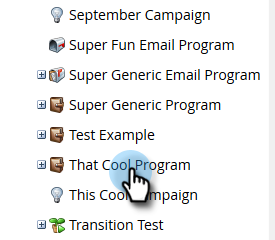
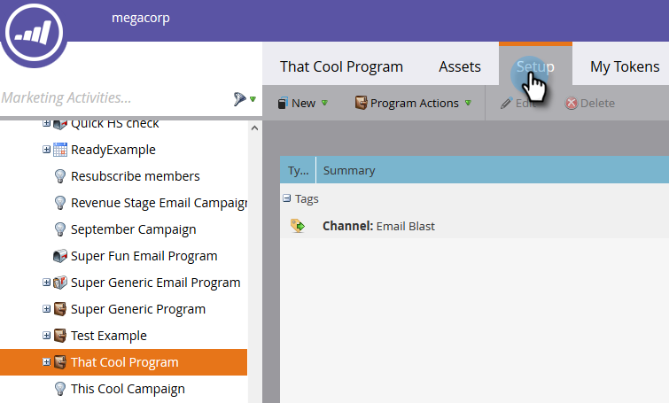
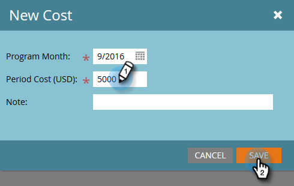
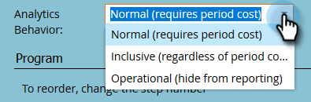

# Configuration De [!UICONTROL Performances Insights] {#setting-up-performance-insights}

Suivez les étapes ci-dessous pour configurer MPI.

## Configuration de l’opportunité {#opportunity-setup}

1. Cliquez sur **[!UICONTROL Admin]**.

   

1. Cliquez sur **[!UICONTROL Revenue Cycle Analytics]**.

   

   >[!NOTE]
   >
   >Si vous n&#39;avez pas de RCA, vous devez sélectionner **[!UICONTROL Analyse de programme]** pour l&#39;étape 2.

1. Sous Attribution, cliquez sur **[!UICONTROL Modifier]**.

   

1. Les Paramètres d’attribution s’affichent.

   

   Si l’attribution est explicite, assurez-vous que le rôle de contact de l’opportunité a été renseigné (soit via le point d’entrée du rôle d’opportunité, soit via l’intégration CRM).

   Si l’attribution est implicite, assurez-vous que le champ société du prospect/contact est identique au nom du compte de l’opportunité.

   >[!NOTE]
   >
   >Assurez-vous que les champs appropriés sont renseignés pour toutes les opportunités :
   >
   >* [!UICONTROL Montant de l’opportunité]
   >* [!UICONTROL Est Fermé]
   >* [!UICONTROL Est Gagné]
   >* [!UICONTROL &#x200B; Date de création &#x200B;] (peut ne pas être définie dans votre cas)
   >* [!UICONTROL Date de clôture] (peut ne pas être définie dans votre cas)
   >* [!UICONTROL &#x200B; Type d’opportunité &#x200B;]

## Configuration du programme {#program-setup}

Mettez à jour les coûts du programme pendant au moins 12 mois. Vous pouvez le faire manuellement ou à l’aide de l’API du programme. Dans cet exemple, nous le faisons manuellement.

1. Cliquez sur **[!UICONTROL Activités marketing]**.

   

1. Recherchez et sélectionnez votre programme.

   

1. Cliquez sur l’onglet **[!UICONTROL Configuration]**.

   

1. Faites glisser **[!UICONTROL Coût de la période]** sur la zone de travail.

   

1. Définissez le mois du programme sur au moins 12 mois, puis cliquez sur **[!UICONTROL Ok]**.

   

1. Définissez le coût de la période et cliquez sur **[!UICONTROL Enregistrer]**.

   

Examinez ensuite le comportement des analyses pour indiquer si un canal particulier doit être inclus dans les analyses. Définissez le comportement d’Analytics (normal, inclusif, opérationnel).

1. Cliquez sur **[!UICONTROL Admin]**.

   

1. Cliquez sur **[!UICONTROL Balises]**.

   

1. Cliquez sur **+** pour développer la liste Canal .

   

1. Double-cliquez sur le canal de votre choix.

   

1. Cliquez sur la liste déroulante **[!UICONTROL Comportement d’Analytics]** et sélectionnez le comportement souhaité.

   

1. Définissez les critères de réussite.

   

1. Cliquez sur **[!UICONTROL Enregistrer]**

   

## Lier le programme à la personne {#tie-the-program-to-the-person}

1. Assurez-vous que le Programme d’acquisition et la Date d’acquisition ont été définis pour chaque personne de votre base de données afin que l’attribution du premier contact fonctionne.
1. Assurez-vous que vos programmes définissent des états de succès pour vos salariés.

>[!NOTE]
>
>Les modifications apportées ne sont pas instantanées. Une période de nuit est nécessaire avant que les modifications ne prennent effet.
