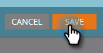

# Configuration des informations de performances {#setting-up-performance-insights}

Suivez les étapes ci-dessous pour configurer MPI.

## Configuration de l’opportunité {#opportunity-setup}

1. Cliquez sur **Admin**.

   

1. Cliquez sur **Revenue Cycle Analytics**.

   

   >[!NOTE]
   >
   >Si vous ne disposez pas d’une autorité de certification, vous devrez sélectionner **Analyse de programme** pour l’étape 2.

1. Sous Attribution, cliquez sur **Modifier**.

   

1. Paramètres d’attribution s’affiche.

   

   Si l’attribution est explicite, assurez-vous que le rôle Contact d’opportunité a été renseigné (via le point de terminaison Rôle d’opportunité ou via l’intégration CRM).

   Si l’attribution est implicite, assurez-vous que le champ de société sur l’prospect/contact est identique au Nom du compte de l’opportunité.

   >[!NOTE]
   >
   >Assurez-vous que les champs appropriés sont renseignés pour toutes les opportunités :
   >
   >* Quantité d&#39;opportunités
   >* Est fermé
   >* Est confirmé
   >* Date de création (cette valeur peut ne pas être définie dans votre cas)
   >* Date de fermeture (cette valeur peut ne pas être définie dans votre cas)
   >* Type de l&#39;opportunité

## Configuration du programme {#program-setup}

Mettre à jour les coûts du programme pendant au moins 12 mois. Vous pouvez le faire manuellement ou à l’aide de l’API de programme. Dans cet exemple, nous le faisons manuellement.

1. Cliquez sur **Activités marketing**.

   

1. Recherchez et sélectionnez votre programme.

   

1. Cliquez sur l’onglet **Setup** .

   

1. Faites glisser **Coût de la période** sur la zone de travail.

   

1. Définissez le Mois du programme pour il y a au moins 12 mois et cliquez sur **Ok**.

   

1. Définissez le coût de la période et cliquez sur **Enregistrer**.

   

Ensuite, passez en revue le comportement des analyses pour indiquer si un canal particulier doit être inclus dans les analyses. Définissez le comportement d’Analytics (normal, inclusif, opérationnel).

1. Cliquez sur **Admin**.

   

1. Cliquez sur **Balises**.

   

1. Cliquez sur **+** pour développer la liste des canaux.

   

1. Double-cliquez sur le canal souhaité.

   

1. Cliquez sur la liste déroulante **Comportement Analytics** et sélectionnez le comportement souhaité.

   

1. Définissez les critères de réussite.

   

1. Cliquez sur **Enregistrer**.

   

## Associer le programme à la personne {#tie-the-program-to-the-person}

1. Assurez-vous que le programme d’acquisition et la date d’acquisition ont été définis pour chaque personne de votre base de données afin que l’attribution Première touche fonctionne.
1. Assurez-vous que vos programmes définissent des états de réussite pour vos employés.

>[!NOTE]
>
>Les changements apportés ne sont pas instantanés. Une période de nuit est nécessaire avant que les modifications ne prennent effet.
