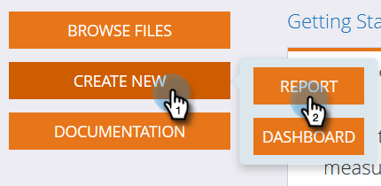

# Créer un rapport d’analyse d’e-mail qui affiche les informations du programme {#build-an-email-analysis-report-that-shows-program-information}

Pour créer un rapport d’analyse des e-mails qui affichera les informations sur les e-mails regroupées par canaux de programme, procédez comme suit.

>[!AVAILABILITY]
>
>Tout le monde n’a pas acheté cette fonctionnalité. Pour plus d’informations, contactez l’équipe du compte Adobe (votre gestionnaire de compte).

1. Lancez **[!UICONTROL Revenue Explorer]**.

   

1. Cliquez sur **[!UICONTROL Créer]** et sélectionnez **[!UICONTROL Rapport]**.

   

1. Sélectionnez la zone **[!UICONTROL Analyse e-mail]** et cliquez sur **[!UICONTROL OK]**.

   

1. Recherchez le point jaune **[!UICONTROL Envoyé (semaine)]** puis cliquez dessus avec le bouton droit. Cliquez sur **[!UICONTROL Filtrer...]**.

   >[!NOTE]
   >
   >Cela réduira le délai de production du rapport.

   

1. Cochez **[!UICONTROL En cours envoyé (semaine)]** puis cliquez sur **[!UICONTROL OK]**.

   

1. Recherchez le point jaune **[!UICONTROL Canal programme]**, puis double-cliquez dessus.

   

1. Recherchez le point jaune **[!UICONTROL Nom de l’e-mail]**, puis double-cliquez dessus.

   

1. Recherchez les points bleus **[!UICONTROL Envoyé]**, **[!UICONTROL Ouvert]** et **[!UICONTROL Cliqué]** et cliquez deux fois dessus.

   

   Très bon travail ! Vous devriez avoir un rapport qui ressemble à ceci :

   
