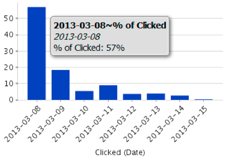
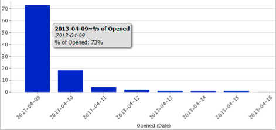

# Présentation de la zone d&#39;Analyse de courriel {#understanding-the-email-analysis-area}

La zone d’Analyse des courriels est axée sur les mesures des courriels. Cet article présente tous les rapports disponibles.

>[!NOTE]
>
>**Disponibilité**
>
>Cette option est disponible pour les utilisateurs disposant de l’édition Select ou du module complémentaire [Revenue Cycle Analytics](http://www.marketo.com/global-enterprise/marketo-revenue-cycle-analytics/). Contactez votre représentant commercial pour plus de détails.

## Grille de chaleur d&#39;Activité de clic électronique {#email-click-activity-heat-grid}

Ce rapport vous montre le jour de la semaine et l&#39;heure à laquelle vos prospects cliquent sur les courriels. Plus la zone est verte, plus le nombre de clics est élevé dans ce jour et cette heure spécifiques. Le filtre actuel inclut tous les courriers électroniques envoyés au cours des 7 derniers jours. Le temps est compté au CST.

## Distribution de temps après clic par courriel {#email-clicked-time-distribution}

Ce rapport présente le pourcentage du nombre total de clics par courriel pour chaque heure de la journée. Le filtre actuel inclut tous les courriers électroniques envoyés au cours des 7 derniers jours. Le temps est compté au CST.

## Baisse du taux de clics par courriel {#email-click-rate-decay}

Ce rapport présente le pourcentage de clics par courriel effectués le même jour que l’envoi d’un courriel et les jours suivants. Le filtre actuel inclut tous les courriers électroniques envoyés il y a 7 jours.

## Grille de chaleur d&#39;Activité ouverte par courriel {#email-open-activity-heat-grid}

Ce rapport vous montre le jour de la semaine et l&#39;heure d&#39;ouverture des courriers électroniques de vos pistes. Plus la boîte est verte, plus elle s&#39;ouvre le jour et l&#39;heure. Le filtre actuel inclut tous les courriers électroniques envoyés au cours des 7 derniers jours. Le temps est compté au CST.

## Décalage de taux ouvert {#open-rate-decay}

Ce rapport indique le pourcentage du nombre total d’ouvertures de courrier électronique survenues le jour même de l’envoi d’un courrier électronique et les jours suivants. Le filtre actuel inclut tous les courriers électroniques envoyés il y a 7 jours.

## Répartition des heures ouvertes {#open-time-distribution}

Ce rapport montre le pourcentage du nombre total d&#39;ouvertures de courrier électronique pour chaque heure de la journée. Le filtre actuel inclut tous les courriers électroniques envoyés au cours des 7 derniers jours. Le temps est compté au CST.

## Grille de chaleur d&#39;Activité envoyée {#sent-activity-heat-grid}

Ce rapport indique le jour de la semaine et l&#39;heure de la journée où vous envoyez vos courriels. Plus la boîte est verte, plus les courriels sont envoyés le jour et l&#39;heure. Le filtre actuel inclut tous les courriers électroniques envoyés au cours des 7 derniers jours. Le temps est compté au CST.

