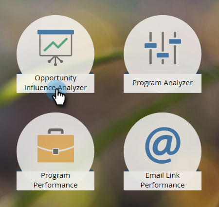

# Créer un analyseur d’influence d’opportunité {#create-an-opportunity-influence-analyzer}

Utilisez l’analyseur d’influence d’opportunité pour afficher la contribution du marketing à une affaire importante. Voyez vos réussites en matière de programmes et d&#39;événements, ainsi que des moments intéressants, dans la vie d&#39;une opportunité.

>[!NOTE]
>
>Pour obtenir de bons renseignements à partir d’un analyseur d’influence d’opportunités, assurez-vous que vos contacts sont associés aux opportunités dans votre CRM.

1. Cliquez sur **[!UICONTROL Analytics]**.

   

1. Cliquez sur **[!UICONTROL Analyseur d’influence d’opportunité]**.

   

1. Sélectionnez le compte dans le panneau **[!UICONTROL Paramètres]**.

   

   >[!NOTE]
   >
   >Si vous recevez un avertissement indiquant qu’aucune activité n’a eu lieu au cours de la période, cliquez simplement sur **[!UICONTROL Fermer]**. Nous y reviendrons après la prochaine étape.

1. Sélectionnez l’opportunité dans ce compte.

   

1. Définissez la période. Cliquez sur l’onglet **[!UICONTROL Configuration]** et double-cliquez sur **[!UICONTROL Période]**.

   

1. Sélectionnez la période de l’opportunité que vous souhaitez analyser et cliquez sur **[!UICONTROL Enregistrer]**.

   

   >[!TIP]
   >
   >
   >Dans la plupart des cas, **[!UICONTROL Tout le temps]** est le choix le plus simple.

1. Le tour est joué. Cliquez sur l’onglet principal pour voir les moments intéressants et les succès impliqués dans l’opportunité.

   

>[!TIP]
>
>Vous pouvez également regarder une vidéo sur Opportunity Influence Analyzer à l’université [Marketo](https://learn.marketo.com). (Ça a l&#39;air un peu différent maintenant, mais il y a encore beaucoup à apprendre !)

>[!MORELIKETHIS]
>
>* [Raconter l’histoire marketing avec un analyseur d’influence d’opportunité](/help/marketo/product-docs/reporting/revenue-cycle-analytics/opportunity-influence-analyzer/tell-the-marketing-story-with-an-opportunity-influence-analyzer.md)
>* [Configuration d’un analyseur d’influence d’opportunité](/help/marketo/product-docs/reporting/revenue-cycle-analytics/opportunity-influence-analyzer/configure-an-opportunity-influence-analyzer.md)
