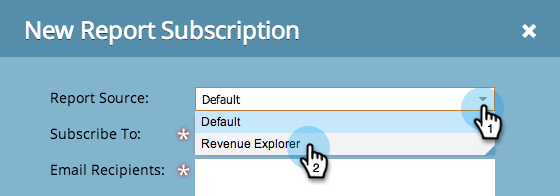

# Exporter les données de l’analyseur d’influence d’opportunité {#export-opportunity-influence-analyzer-data}

Pour recevoir des mises à jour de vos rapports Revenue Cycle Explorer et les partager, vous pouvez abonner n’importe quelle adresse e-mail à un rapport existant.

1. Accédez à **[!UICONTROL Analytics]** et sélectionnez **[!UICONTROL Nouveau]** > **[!UICONTROL Nouvel abonnement au rapport]**.

   

   >[!NOTE]
   >
   >Pour vous abonner à un rapport de base que vous avez créé dans un programme, voir [S’abonner à un rapport de base](/help/marketo/product-docs/reporting/basic-reporting/report-subscriptions/subscribe-to-a-basic-report.md).

1. Pour **[!UICONTROL Report Source]**, sélectionnez **[!UICONTROL Explorateur de revenus]**.

   

1. Parcourez l’arborescence et sélectionnez le rapport.

   

1. Saisissez la ou les adresses e-mail et définissez la fréquence des e-mails de rapport.

   

   >[!NOTE]
   >
   >Tout le monde peut se désabonner du rapport dans l’e-mail qu’il reçoit.

1. Votre abonnement est prêt ! Si vous avez inclus votre propre adresse e-mail, vous recevrez le rapport par e-mail.

   

>[!MORELIKETHIS]
>
>Découvrez comment [gérer tous vos abonnements aux rapports](/help/marketo/product-docs/reporting/basic-reporting/report-subscriptions/manage-report-subscriptions.md) au même endroit.
