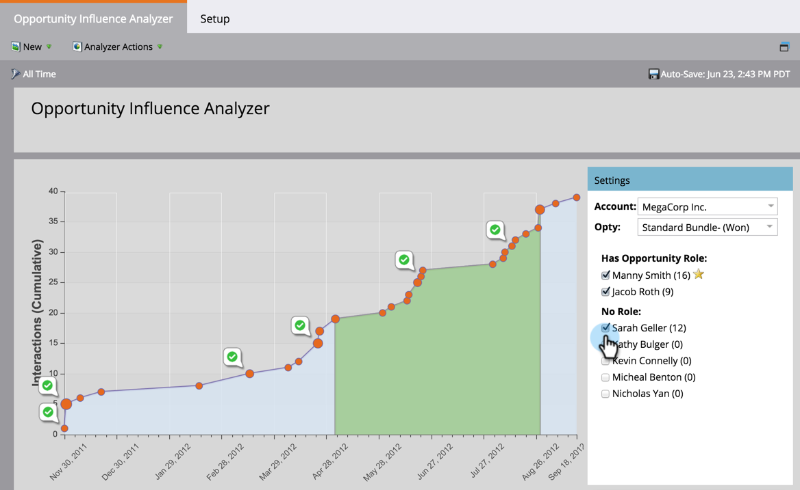

# Analyseur d’influence d’opportunité pour raconter l’article marketing {#tell-the-marketing-story-with-an-opportunity-influence-analyzer}

Utilisez un analyseur d&#39;influence d&#39;opportunité pour illustrer le rôle du marketing dans les opportunités importantes. Montrez comment le marketing a influencé une opportunité, de la première touche à la création et à la victoire d&#39;opportunités, et au-delà.

>[!NOTE]
>
>**Conditions préalables**
>
>* [Création d’un analyseur d’influence d’opportunité](create-an-opportunity-influence-analyzer.md)

>

1. Accédez à **Analytics** et sélectionnez l’analyseur **d’influence d’** opportunité.

   

   L&#39;analyseur d&#39;influence sur les opportunités est une représentation visuelle des interactions et des succès programmes et événements impliqués dans cette opportunité. Explorons le graphique :

   * **** orange représentent des moments  intéressants dans l&#39;opportunité (e-mails ouverts, visites de cabines de commerce, téléchargements de livres blancs, etc.). Les points plus grands indiquent davantage d’interactions.

   * ` 

      Les icônes **de** liaison indiquent les réussites [programmes](https://community.marketo.com/MarketoDeepDive?id=kA5500000008QO6CAM) .

   * **  Les icônes de calendrier** indiquent les réussites [événements](https://community.marketo.com/MarketoDeepDive?id=kA5500000008QNwCAM) .

   * **Période** d&#39;opportunité. La zone verte représente l&#39;opportunité elle-même, de la création d&#39;opportunités à la fermeture d&#39;opportunités (gagnées ou perdues).
   * **Cycle** de vie des opportunités. Les zones grises avant et après la période d&#39;opportunité verte montrent les interactions qui ont conduit et suivi cette opportunité.

   Le panneau **Paramètres** liste les personnes du compte :

   * Le **nombre entre parenthèses** correspond au nombre d’interactions avec ce contact.
   * L&#39;étoile **** jaune indique le contact Principal.

1. Passez la souris sur un nom pour afficher le titre de l&#39;emploi de cette personne et la source de son implication dans l&#39;opportunité.

   

1. Cochez la case pour inclure les interactions de cette personne dans le graphique.

   

   Le graphique s’ajuste automatiquement pour afficher leurs interactions dans l’opportunité. Dans cet exemple, nous constatons immédiatement que Sarah Geller, PDG de MegaCorp, a été profondément impliquée dans cette opportunité, même si aucun rôle n&#39;a été attribué à la CRM pour cette opportunité.

1. Cliquez sur un point orange pour afficher les détails de l’interaction.

   

   Dans notre exemple, nous apprenons que le PDG Sarah Geller a visité le site plusieurs fois et s&#39;est même abonnée au blog. Cela suggère que l&#39;intérêt de MegaCorp pour cette opportunité a été motivé, en grande partie, par des programmes et des actifs marketing.

   Cliquez sur d&#39;autres points oranges le long de la chronologie pour suivre l&#39;histoire des événements, programmes et moments intéressants qui ont contribué à créer et à fermer l&#39;opportunité.

   >[!NOTE]
   >
   >**Articles connexes**
   >
   >
   >    
   >    
   >    * [Configuration d’un analyseur d’influence d’opportunité](configure-an-opportunity-influence-analyzer.md)
      >    
      >    
      >
      >
      >    
      >    
      >    

   * [Rapports de base](http://docs.marketo.com/display/docs/basic+reporting)

