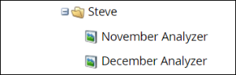

# Cloner un analyseur de Programme {#clone-a-program-analyzer}

Après avoir enregistré un analyseur, il est facile de le cloner pour en créer un nouveau. Ensuite, entrez et modifiez la nouvelle version si elle a besoin de modifications.

1. Cliquez sur la **mosaïque Analytics **.

   

1. Cliquez sur la mosaïque **Analyseur de Programme**.

   

1. Tandis que l’analyseur enregistré est ouvert, ouvrez la liste déroulante Actions Analyzer et sélectionnez **Cloner l’analyseur**.

   

1. Sélectionnez l’emplacement de l’analyseur cloné dans les listes déroulantes **Cloner à** et **Dossier**.

   

1. Nommez l’analyseur cloné et cliquez sur **Cloner**.

   

1. Maintenant, vous avez deux analyseurs identiques avec des noms différents. Ouvrez le clone pour apporter les modifications nécessaires.

   

   >[!NOTE]
   >
   >**Articles connexes**
   >
   >    
   >    
   >    * [Création d’un analyseur de Programme](create-a-program-analyzer.md)

