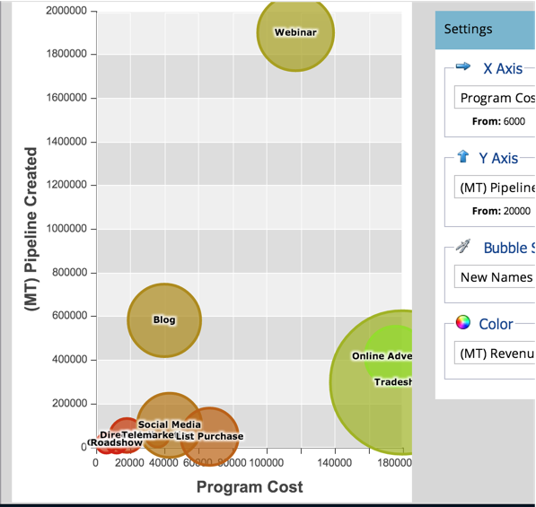

# Comparaison de l’efficacité des canaux avec l’analyseur de programme {#compare-channel-effectiveness-with-the-program-analyzer}

Utilisez l’analyseur de programme pour comparer les coûts des canaux, l’acquisition des membres, le pipeline, les recettes, etc., afin d’identifier vos canaux les plus efficaces et les moins efficaces.

>[!PREREQUISITES]
>
>[Créer un analyseur de programme](/help/marketo/product-docs/reporting/revenue-cycle-analytics/program-analytics/create-a-program-analyzer.md)

1. Cliquez sur **Analytics** dans **My Marketo**.

   

1. Sélectionnez votre **analyseur de programme**.

   

1. Remplacez la vue par **Par canal**.

   

1. Utilisez la liste déroulante **Axe X** pour choisir une mesure pour l’axe horizontal. Commençons par **Coût du programme**.

   

1. Utilisez la liste déroulante Axe Y pour sélectionner une mesure pour l’axe vertical. Ici, nous allons utiliser le pipeline **(FT) créé**.

   

   >[!NOTE]
   >
   >La plupart des mesures que vous pouvez sélectionner dans l’analyseur de programme sont disponibles avec les calculs Première touche (FT) et multipoint (MT). Il est important de comprendre la [différence entre l’attribution FT et MT](/help/marketo/product-docs/reporting/revenue-cycle-analytics/revenue-tools/attribution/understanding-attribution.md).

1. Utilisez la liste déroulante **Axe Y** pour choisir le pipeline **(MT) créé**.

   

   Dans cette vue d’attribution multi-touch, nous voyons que le canal Webinaire a plus d’influence sur le pipeline créé et coûte moins cher que les canaux Tradeshow et Online Advertising.

   Ajoutons maintenant deux dimensions supplémentaires !

1. Utilisez la liste déroulante **Taille de bulle** pour sélectionner une mesure supplémentaire, telle que **Noms nouveaux**.

   

1. Regardez comment le graphique change.

   

   Nous constatons que le canal Webinaire se rétrécit, comme mesuré par **Nouveaux noms**. Nous pouvons conclure que, bien qu&#39;il compte de nombreux membres, il est moins efficace de générer de nouvelles pistes que le canal Tradeshow.

1. Enfin, utilisez la liste déroulante Couleur pour ajouter la quatrième dimension. Sélectionnez **(FT) Recettes gagnées**.

   

1. Regardez les couleurs changer dans votre graphique.

   

   À partir des couleurs, nous apprenons que le canal Tradeshow, la bulle la plus verte, a influencé les plus grandes recettes gagnées, comme mesuré par l’attribution Première touche.

1. Maintenant, si nous remplaçons la mesure des couleurs par **(MT) Recettes gagnantes**, nous constatons que le canal Advertising en ligne, désormais le plus vert, a influencé plus de recettes au fil du temps que les canaux Webinaire et Tradeshow.

   

Dans notre exemple, nous voyons que le canal Tradeshow est à la fois le plus cher (le plus à droite) et le plus performant (le plus élevé sur l’axe Y) lors de la mesure du pipeline créé par Première touche. Maintenant, considérons le pipeline de chaque canal créé comme mesuré par l’attribution multi-touch.

>[!TIP]
>
>Les exemples de ces étapes mesurent l’efficacité en fonction du pipeline créé. Utilisez la liste déroulante Axe Y pour sélectionner d’autres méthodes de mesure de l’efficacité des canaux, telles que Nouveaux noms, Membres, Coût par succès, etc.

>[!MORELIKETHIS]
>
>* [Explorer les détails du programme et du canal avec l’analyseur de programme](/help/marketo/product-docs/reporting/revenue-cycle-analytics/program-analytics/explore-program-and-channel-details-with-the-program-analyzer.md)
>* [Comparer l’efficacité du programme à l’analyseur de programme](/help/marketo/product-docs/reporting/revenue-cycle-analytics/program-analytics/compare-program-effectiveness-with-the-program-analyzer.md)
