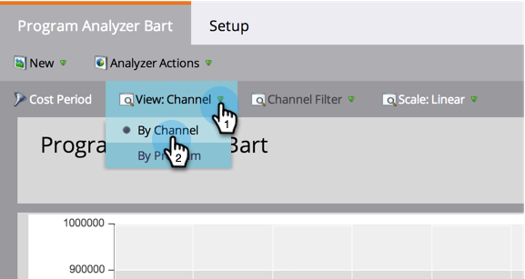

# Comparer l&#39;efficacité des Canaux avec l&#39;analyseur de Programme {#compare-channel-effectiveness-with-the-program-analyzer}

Utilisez Programme Analyzer pour comparer les coûts de canal, l&#39;acquisition de membres, le pipeline, les recettes, etc., afin d&#39;identifier vos canaux les plus efficaces et les moins efficaces.

>[!PREREQUISITES]
>
>* [Création d’un analyseur de Programme](create-a-program-analyzer.md)

1. Cliquez sur **Analytics** dans **Mon marketing.**

   

1. Sélectionnez votre analyseur de **Programmes.**

   

1. Modifiez la Vue en Par **** Canal ****.

   

1. Utilisez la liste déroulante Axe **** X pour choisir une mesure pour l’axe horizontal. Début avec le coût **du** Programme.

   

1. Utilisez la liste déroulante Axe Y pour choisir une mesure pour l’axe vertical. Ici, nous allons aller avec **(FT) Pipeline créé**.

   

   >[!NOTE]
   >
   >La plupart des mesures que vous pouvez choisir dans l’analyseur de programme sont disponibles avec les calculs Première touche (FT) et Multipoint (MT). Il est important de comprendre la [différence entre l’attribution](/help/marketo/product-docs/reporting/revenue-cycle-analytics/revenue-tools/attribution/understanding-attribution.md)FT et MT.

1. Utilisez la liste déroulante Axe **** Y pour choisir **(MT) Pipeline Created**.

   

   Dans cette vue d&#39;attribution multipoint, nous constatons que le canal Webinaire a plus d&#39;influence sur le canal créé et coûte moins que les canaux de commerce et de publicité en ligne.

   Ajoutons maintenant deux dimensions supplémentaires !

1. Utilisez la liste déroulante Taille **de la** bulle pour sélectionner une mesure supplémentaire, telle que **Nouveaux noms**.

   

1. Regardez comment le graphique change.

   

   Nous voyons que le canal Webinaire se rétrécit, comme mesuré par **Nouveaux noms**. Nous pouvons en conclure que, bien qu&#39;elle compte de nombreux membres, elle est moins efficace pour générer de nouvelles pistes que le canal du commerce.

1. Enfin, utilisez la liste déroulante Couleur pour ajouter la quatrième dimension. Sélectionnez **(FT) Recettes** **gagnées**.

   

1. Regardez les couleurs changer dans votre graphique.

   

   D&#39;après les couleurs, nous apprenons que le canal de commerce, la bulle la plus verte, a influencé les plus grosses recettes gagnées, comme mesuré par l&#39;attribution Première touche.

1. Maintenant, si nous changeons la mesure Couleur en Recettes gagnées ****(MT), nous constatons que le canal de publicité en ligne, désormais le plus vert, a influencé plus de recettes au fil du temps que les canaux Webinaire et Tradeshow.

   

Dans notre exemple, nous constatons que le canal Tradeshow est à la fois le plus cher (le plus à droite) et le plus performant (le plus élevé sur l&#39;axe Y) lors de la mesure du pipeline créé par la première touche. Examinons maintenant chaque pipeline de canal créé comme mesuré par une attribution multipoint.

>[!TIP]
>
>Les exemples de ces étapes mesurent l&#39;efficacité en fonction du pipeline créé. Utilisez la liste déroulante Axe Y pour sélectionner d’autres méthodes de mesure de l’efficacité du canal, telles que Nouveaux noms, Membres, Coût par réussite, etc.

>[!NOTE]
>
>**Articles connexes**
>
>* [Explorez les détails sur les Programmes et les Canaux à l&#39;aide de l&#39;analyseur de Programmes](explore-program-and-channel-details-with-the-program-analyzer.md)
>* [Comparer l&#39;efficacité des Programmes avec l&#39;analyseur de Programme](compare-program-effectiveness-with-the-program-analyzer.md)

>

>[!NOTE]
>
>En savoir plus sur les analyses avancées dans l’explorateur Recettes Cycle.
