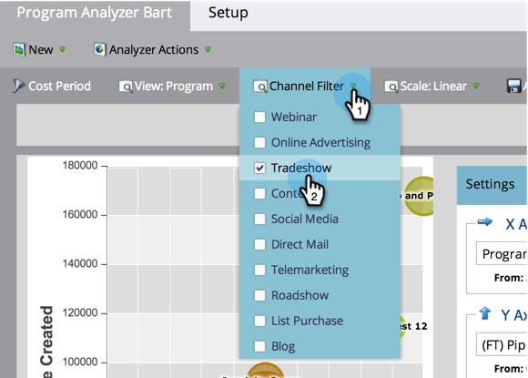

# Comparer l&#39;efficacité des Programmes avec l&#39;analyseur de Programme {#compare-program-effectiveness-with-the-program-analyzer}

Utilisez Programme Analyzer pour identifier vos programmes les plus et les moins efficaces, en comparant les coûts de programme, l&#39;acquisition de membres, le pipeline et les recettes.

>[!PREREQUISITES]
>
>* [Création d’un analyseur de Programme](create-a-program-analyzer.md)

1. Cliquez sur Analytics.

   

1. Sélectionnez votre analyseur de Programmes.

   

1. Modifiez la Vue en Par Programme.

   

1. Utilisez le filtre de Canal pour réduire la vue à un ou deux canaux seulement. Pour l&#39;instant, nous allons examiner les programmes du canal du commerce.

   

   >[!TIP]
   >
   >Pour filtrer rapidement les programmes sur un seul canal, sélectionnez **Vue > Par Canal**, cliquez sur la bulle correspondant à ce canal, puis cliquez sur le nom du canal dans la boîte de dialogue contextuelle.

1. Utilisez la liste déroulante Axe X pour choisir une mesure pour l’axe horizontal. Nous allons début avec le coût du Programme.

   

1. Utilisez la liste déroulante Axe Y pour choisir une mesure pour l’axe vertical. Choisissons de nouveaux noms pour trouver des programmes capables de capturer de nouvelles pistes.

   

1. Activez les curseurs pour effectuer un zoom avant.

   

   >[!TIP]
   >
   >Vous pouvez également essayer d&#39;améliorer votre vue en passant d&#39;une échelle linéaire à une échelle logarithmique, ou vice versa. Utilisez le menu **Échelle** en haut de l&#39;écran.

1. Explorez le graphique qui en résulte.

   

   Dans notre exemple, nous apprenons que l&#39;Exposition Origami est bien meilleure que tous les autres programmes dans ce canal pour capturer de nouveaux noms, et à un coût moyen. Mais ce n&#39;est pas tout. Nous allons ajouter deux autres mesures pour mieux comprendre.

1. Utilisez la liste déroulante Taille des bulles pour choisir une mesure à comparer en fonction de la taille des bulles. Nous choisirons (FT) Recettes gagnées pour notre exemple.

   

   >[!NOTE]
   >
   >La plupart des mesures que vous pouvez choisir dans l’analyseur de programme sont disponibles avec les calculs Première touche (FT) et Multipoint (MT). Il est important de comprendre la [différence entre l’attribution](/help/marketo/product-docs/reporting/revenue-cycle-analytics/revenue-tools/attribution/understanding-attribution.md)FT et MT.

1. Regardez la taille des bulles changer dans votre graphique.

   

   En ajoutant **(FT) Revenu gagné**, nous voyons rapidement que, bien que l&#39;Expo Origami ait acquis beaucoup de nouveaux noms, elle produit relativement peu de recettes. De plus, nous constatons que le programme Paper Fest 12 prend moins de noms, mais de meilleurs noms, car il influence plus de recettes gagnées (plus grande bulle).

1. Utilisez la liste déroulante Couleur pour ajouter une quatrième mesure. Nous allons examiner les recettes d&#39;investissement (FT).

   

1. Regardez les couleurs changer dans votre graphique.

   

Nous constatons que le programme Paper Fest 12 n&#39;influence pas seulement plus de revenus (plus grande bulle), mais malgré son coût de programme relativement élevé (à l&#39;extrême droite), il a le meilleur retour sur investissement (la bulle la plus verte) de tous les programmes du canal Tradeshow.

>[!TIP]
>
>Vous pouvez rapidement comparer les programmes d’un canal à ceux d’un autre. Il vous suffit d&#39;utiliser le filtre **de** Canal en haut de la fenêtre pour ajouter d&#39;autres canaux.

>[!NOTE]
>
>**Articles connexes**
>
>* [Explorez les détails sur les Programmes et les Canaux à l&#39;aide de l&#39;analyseur de Programmes](explore-program-and-channel-details-with-the-program-analyzer.md)
>* [Comparer l&#39;efficacité des Canaux avec l&#39;analyseur de Programme](compare-channel-effectiveness-with-the-program-analyzer.md)

>[!NOTE]
>
>En savoir plus sur les analyses avancées dans l’explorateur Recettes Cycle.
