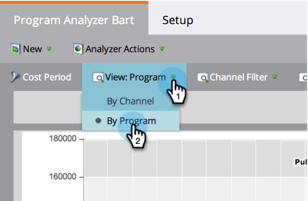

# Comparaison de l’efficacité du programme avec l’analyseur de programme {#compare-program-effectiveness-with-the-program-analyzer}

Utilisez l’analyseur de programme pour identifier vos programmes les plus et les moins efficaces, en comparant les coûts de programme, l’acquisition de membres, le pipeline et les recettes.

>[!PREREQUISITES]
>
>[Créer un analyseur de programme](/help/marketo/product-docs/reporting/revenue-cycle-analytics/program-analytics/create-a-program-analyzer.md)

1. Cliquez sur **Analytics**.

   

1. Sélectionnez votre analyseur de programme.

   

1. Remplacez la vue par le programme .

   

1. Utilisez le filtre Canal pour réduire la vue à un ou deux canaux seulement. Pour l’instant, nous allons examiner les programmes du canal Tradeshow.

   

   >[!TIP]
   >
   >Pour filtrer rapidement les programmes sur un seul canal, sélectionnez **Afficher** > **Par canal**, cliquez sur la bulle de ce canal, puis cliquez sur le nom du canal dans la boîte de dialogue contextuelle.

1. Utilisez la liste déroulante Axe X pour sélectionner une mesure pour l’axe horizontal. Commençons par le coût du programme.

   

1. Utilisez la liste déroulante Axe Y pour sélectionner une mesure pour l’axe vertical. Choisissons de nouveaux noms pour trouver des programmes qui sont bons pour capturer de nouvelles pistes.

   

1. Activez les curseur pour effectuer un zoom avant.

   

   >[!TIP]
   >
   >Vous pouvez également essayer d’améliorer votre vue en passant d’une échelle linéaire à une échelle logarithmique, ou vice versa. Utilisez le menu **Échelle** en haut.

1. Explorez le graphique obtenu.

   

   Dans notre exemple, nous apprenons que l&#39;Exposition Origami est bien meilleure que tous les autres programmes de ce canal pour capturer de nouveaux noms, et à un coût moyen. Mais ce n&#39;est pas tout. Nous ajouterons deux autres mesures pour mieux comprendre ce qui se passe.

1. Utilisez la liste déroulante Taille de bulle pour sélectionner une mesure à comparer en fonction de la taille des bulles. Nous choisirons (FT) Recettes gagnées pour notre exemple.

   

   >[!NOTE]
   >
   >La plupart des mesures que vous pouvez sélectionner dans l’analyseur de programme sont disponibles avec les calculs Première touche (FT) et multipoint (MT). Il est important de comprendre la [différence entre l’attribution FT et MT](/help/marketo/product-docs/reporting/revenue-cycle-analytics/revenue-tools/attribution/understanding-attribution.md).

1. Observez la taille des bulles dans votre graphique.

   

   En ajoutant **(FT) Recettes gagnantes**, nous voyons rapidement que, bien que l’Exposition Origami ait acquis beaucoup de nouveaux noms, elle génère relativement peu de recettes. De plus, nous voyons que le programme de la 12ème Bataille de Papier prend moins de noms, mais de meilleurs noms, car il influence plus de recettes gagnées (plus grande bulle).

1. Utilisez la liste déroulante Couleur pour ajouter une quatrième mesure. Nous allons examiner le rapport Recettes - Investissement.

   

1. Regardez les couleurs changer dans votre graphique.

   

Nous voyons que le programme Paper Fest 12 influence non seulement plus les revenus (plus grosse bulle), mais malgré son coût de programme relativement élevé (à l&#39;extrême droite), il a le meilleur retour sur investissement (la plus grosse bulle) de tous les programmes du canal Tradeshow.

>[!TIP]
>
>Vous pouvez rapidement comparer les programmes d’un canal à ceux d’un autre. Utilisez simplement le **filtre de canal** en haut de la fenêtre pour ajouter d’autres canaux.

>[!MORELIKETHIS]
>
>* [Explorer les détails du programme et du canal avec l’analyseur de programme](/help/marketo/product-docs/reporting/revenue-cycle-analytics/program-analytics/explore-program-and-channel-details-with-the-program-analyzer.md)
>* [Comparaison de l’efficacité des canaux avec l’analyseur de programme](/help/marketo/product-docs/reporting/revenue-cycle-analytics/program-analytics/compare-channel-effectiveness-with-the-program-analyzer.md)
