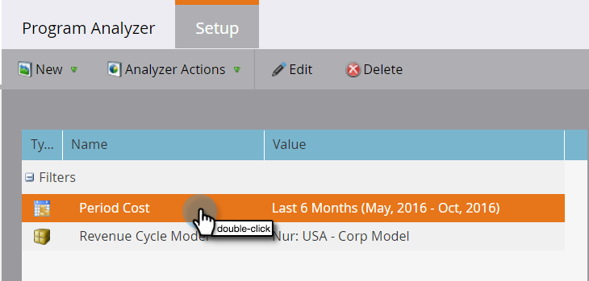

# Créer un analyseur de Programme {#create-a-program-analyzer}

Découvrez les programmes et les canaux qui vous donnent le plus d&#39;argent pour votre marketing. Utilisez l&#39;analyseur de programme pour analyser et comparer chaque coût et chaque retour en détail, par programme ou par canal.

>[!NOTE]
>
>Pour obtenir de bonnes données d&#39;un analyseur de programme, assurez-vous que vos contacts CRM ont un rôle dans les opportunités et que vos programmes Marketo sont entièrement configurés, avec [les coûts de période](/help/marketo/product-docs/reporting/revenue-cycle-analytics/revenue-tools/define-period-costs.md), les états de programme et la réussite définis.

>[!TIP]
>
>Pour que les programmes sans coût apparaissent dans l&#39;analyseur de programme, [définissez leur coût de période](/help/marketo/product-docs/reporting/revenue-cycle-analytics/revenue-tools/define-period-costs.md) sur 0 dollar.

1. Cliquez sur la mosaïque **Analyses**.

   

1. Cliquez sur la mosaïque **Analyseur de Programme**.

   

1. L&#39;analyseur de programme standard s&#39;affiche. Apportez les modifications nécessaires.

   

1. Cliquez sur l&#39;onglet **Configuration** pour ajouter et personnaliser des filtres.

   

1. Par exemple, pour personnaliser le filtre Coût par période, cliquez sur le filtre en doublon.

   

1. Sélectionnez la période à analyser et cliquez sur **Appliquer**.

   

   >[!TIP]
   >
   >Pour sélectionner une plage spécifique, sélectionnez **Personnalisé** et utilisez les champs **De** et **À**.

1. Si vous souhaitez enregistrer votre nouvel analyseur personnalisé, dans la liste déroulante Actions Analyzer, sélectionnez **Enregistrer sous**.

   

1. Sélectionnez l’emplacement d’enregistrement de l’analyseur personnalisé à l’aide des listes déroulantes Enregistrer dans et Dossier. Nommez le nouvel analyseur personnalisé. Une description est facultative. Cliquez sur **Enregistrer**.

   

1. Tu l&#39;as fait ! Cliquez sur l&#39;onglet principal pour début explorer et comparer vos programmes et canaux.

>[!NOTE]
>
>La plupart des mesures que vous pouvez choisir dans l’analyseur de programme sont disponibles avec les calculs Première touche (FT) et Multipoint (MT). Il est important de comprendre la différence [entre l’attribution FT et l’attribution MT](/help/marketo/product-docs/reporting/revenue-cycle-analytics/revenue-tools/attribution/understanding-attribution.md).

>[!MORELIKETHIS]
>
>* [Comparer l&#39;efficacité des Canaux avec l&#39;analyseur de Programme](/help/marketo/product-docs/reporting/revenue-cycle-analytics/program-analytics/compare-channel-effectiveness-with-the-program-analyzer.md)
>* [Comparer l&#39;efficacité des Programmes avec l&#39;analyseur de Programme](/help/marketo/product-docs/reporting/revenue-cycle-analytics/program-analytics/compare-program-effectiveness-with-the-program-analyzer.md)
>* [Explorez les détails sur les Programmes et les Canaux à l&#39;aide de l&#39;analyseur de Programmes](/help/marketo/product-docs/reporting/revenue-cycle-analytics/program-analytics/explore-program-and-channel-details-with-the-program-analyzer.md)
>* [Clonage d’un analyseur de Programme](/help/marketo/product-docs/reporting/revenue-cycle-analytics/program-analytics/clone-a-program-analyzer.md)

