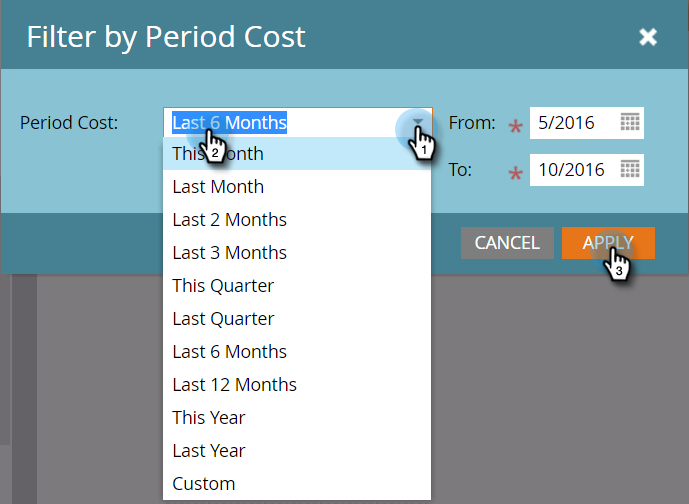

# Créer un [!UICONTROL analyseur de programmes] {#create-a-program-analyzer}

Découvrez quels programmes et canaux vous offrent le meilleur retour sur investissement en matière de marketing. Utilisez l&#39;analyseur de programmes pour examiner et comparer chaque coût et retour en détail, par programme ou par canal.

>[!NOTE]
>
>Pour obtenir de bonnes données d’un analyseur de programme, assurez-vous que vos contacts CRM disposent de rôles dans les opportunités et que vos programmes Marketo sont entièrement configurés, avec des [coûts de la période](/help/marketo/product-docs/reporting/revenue-cycle-analytics/revenue-tools/define-period-costs.md), statuts du programme et succès définis.

>[!TIP]
>
>Pour que les programmes sans coût apparaissent dans l&#39;analyseur de programmes, [définissez leur coût de période](/help/marketo/product-docs/reporting/revenue-cycle-analytics/revenue-tools/define-period-costs.md) sur 0 $.

1. Cliquez sur la mosaïque **[!UICONTROL Analytics]**.

   

1. Cliquez sur la mosaïque **[!UICONTROL Analyseur de programmes]**.

   

1. L’analyseur de programme standard s’affiche. Apportez les modifications nécessaires.

   

1. Cliquez sur l’onglet **[!UICONTROL Configuration]** pour ajouter et personnaliser des filtres.

   

1. Par exemple, pour personnaliser le filtre [!UICONTROL Coût de la période], double-cliquez dessus.

   

1. Sélectionnez la période à analyser et cliquez sur **[!UICONTROL Appliquer]**.

   

   >[!TIP]
   >
   >Pour sélectionner une plage spécifique, sélectionnez **[!UICONTROL Personnalisé]** et utilisez les champs **[!UICONTROL De]** et **[!UICONTROL À]**.

1. Si vous souhaitez enregistrer votre nouvel analyseur personnalisé, dans le menu déroulant **[!UICONTROL Actions de l’analyseur]**, sélectionnez **[!UICONTROL Enregistrer sous]**.

   

1. Sélectionnez l’emplacement où vous souhaitez enregistrer l’analyseur personnalisé à l’aide des listes déroulantes [!UICONTROL Enregistrer dans] et [!UICONTROL Dossier]. Nommez le nouvel analyseur personnalisé. Une description est facultative. Cliquez sur **[!UICONTROL Enregistrer]**

   

1. Tu l&#39;as fait ! Cliquez sur l’onglet principal pour commencer à explorer et à comparer vos programmes et canaux.

>[!NOTE]
>
>De nombreuses mesures que vous pouvez choisir dans l’analyseur de programme sont disponibles avec les calculs Première touche (FT) et Multitouche (MT). Il est important de comprendre la [ différence entre l’attribution FT et MT](/help/marketo/product-docs/reporting/revenue-cycle-analytics/revenue-tools/attribution/understanding-attribution.md).

>[!MORELIKETHIS]
>
>* [Comparer l’efficacité des canaux avec l’[!UICONTROL analyseur de programmes]](/help/marketo/product-docs/reporting/revenue-cycle-analytics/program-analytics/compare-channel-effectiveness-with-the-program-analyzer.md)
>* [Comparer l’efficacité du programme avec l’[!UICONTROL Analyseur de programmes]](/help/marketo/product-docs/reporting/revenue-cycle-analytics/program-analytics/compare-program-effectiveness-with-the-program-analyzer.md)
>* [Explorer les détails du programme et du canal avec l’[!UICONTROL analyseur de programmes]](/help/marketo/product-docs/reporting/revenue-cycle-analytics/program-analytics/explore-program-and-channel-details-with-the-program-analyzer.md)
>* [Clonage d’un [!UICONTROL analyseur de programme]](/help/marketo/product-docs/reporting/revenue-cycle-analytics/program-analytics/clone-a-program-analyzer.md)
