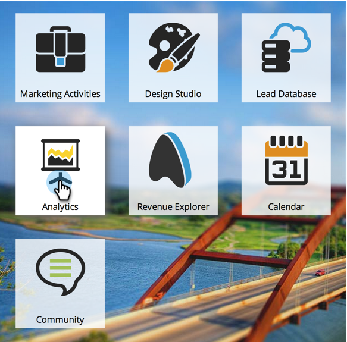
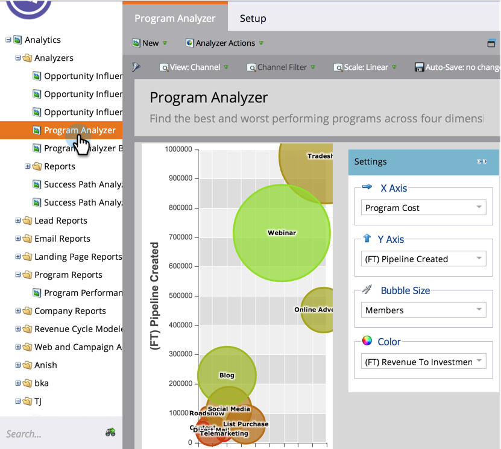
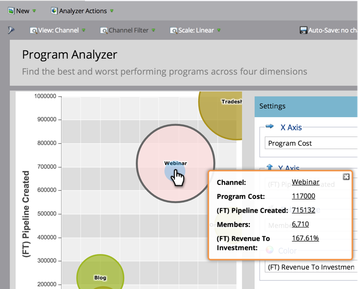
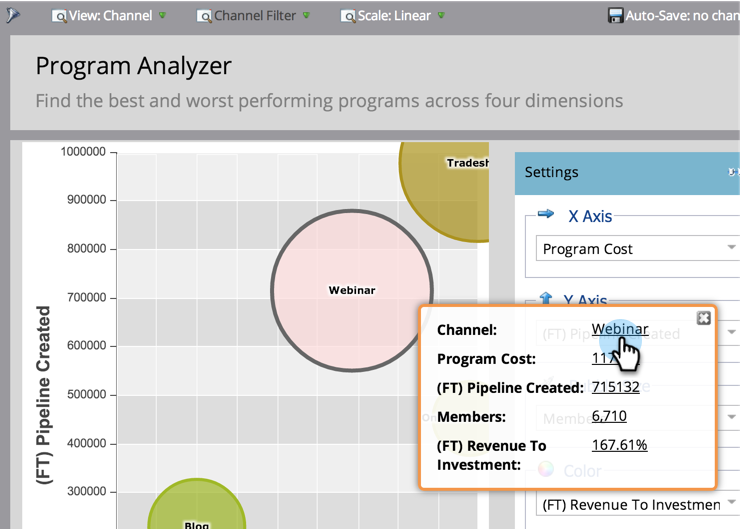
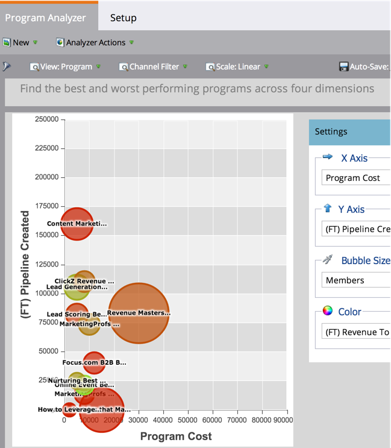
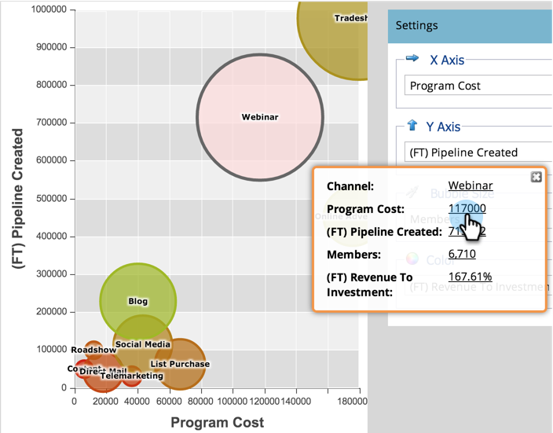

# Explorez les détails des programmes et des canaux avec l’[!UICONTROL analyseur de programmes] {#explore-program-channel-details-with-the-program-analyzer}

Vous pouvez afficher les statistiques détaillées sur les programmes et les canaux dans l’[!UICONTROL Analyseur de programmes]. Vous pouvez également les ouvrir dans l’Explorateur du cycle du chiffre d’affaires.

>[!PREREQUISITES]
>
>[Créer un [!UICONTROL analyseur de programmes]](/help/marketo/product-docs/reporting/revenue-cycle-analytics/program-analytics/create-a-program-analyzer.md)

>[!AVAILABILITY]
>
>Toutes les éditions de Marketo n’incluent pas cette fonctionnalité. Contactez votre gestionnaire de compte pour plus d’informations.

1. Cliquez sur **[!UICONTROL Analytics]**.

   

1. Sélectionnez l’analyseur de programmes.

   

1. Pour afficher les statistiques spécifiques d’un canal ou d’un programme (selon la **[!UICONTROL Vue]** que vous sélectionnez), cliquez sur la bulle correspondante.

   

   >[!NOTE]
   >
   >De nombreuses mesures que vous pouvez choisir dans l’analyseur de programme sont disponibles avec les calculs Première touche (FT) et Multitouche (MT). Il est important de comprendre la [&#x200B; différence entre l’attribution FT et MT](/help/marketo/product-docs/reporting/revenue-cycle-analytics/revenue-tools/attribution/understanding-attribution.md).

1. Pour comparer tous les programmes au sein d’un seul canal, cliquez sur le nom du canal dans la boîte de dialogue pop-up.

   

1. Vous pouvez maintenant comparer les programmes individuels dans ce canal !

   

   >[!NOTE]
   >
   >Cliquer sur un seul canal fait basculer votre affichage sur Par programme, filtré uniquement sur ce canal. Pour revenir à tous les canaux, sélectionnez **[!UICONTROL Affichage]** > **[!UICONTROL Par canal]**.

1. Pour ouvrir l’Explorateur du cycle du chiffre d’affaires et approfondir davantage une statistique, cliquez sur ce nombre dans la boîte de dialogue pop-up.

   
