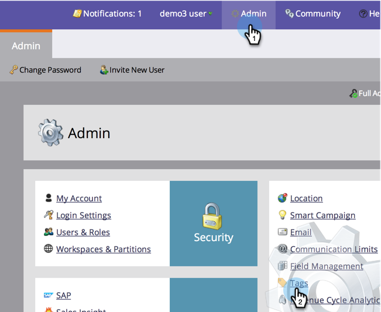

# Rendre un Programme sans coût de période disponible dans l&#39;Explorateur de recettes et les analyseurs {#make-a-program-without-a-period-cost-available-in-revenue-explorer-and-analyzers}

Coûts de la période de programme vous permet de définir &quot;Combien d&#39;argent&quot; et &quot;Quand&quot; pour un programme. Cela s’affiche dans l’Explorateur de cycles de recettes et les [analyseurs](/help/marketo/product-docs/reporting/revenue-cycle-analytics/opportunity-influence-analyzer/tell-the-marketing-story-with-an-opportunity-influence-analyzer.md).

>[!NOTE]
>
>**Autorisations d’administrateur requises**

Certains programmes peuvent avoir besoin d&#39;être inclus même s&#39;ils n&#39;ont pas de coût de période. Bien que vous puissiez entrer 0 pour le coût de la période, nous avons facilité l&#39;inclusion de ces programmes.

>[!NOTE]
>
>L’analyseur de Programme intègre la fonction Réussite du Programme par coût de période. Si aucun coût de période n’est disponible, le Programme Réussite ne s’affichera pas, quel que soit le comportement d’analyse du programme. Si le comportement d’analyse est configuré, les données s’affichent pour les mesures d’opportunités (opportunités de pipeline, recettes gagnées, etc.).

1. Sous la section Admin, cliquez sur **Balises**.

   

1. Développez vos Canaux et cliquez sur le canal de votre choix en cliquant sur celui-ci.

   >[!NOTE]
   >
   >Tous les programmes qui utilisent ce canal, quel que soit le coût de la période, seront disponibles pour les analyseurs et explorateurs de recettes. Ce changement prendra effet le lendemain.

   

1. Modifiez le comportement d’Analytics en Inclusif et cliquez sur **Enregistrer**.

   

>[!TIP]
>
>Avez-vous remarqué l&#39;option Opérationnelle ? Cela fait le contraire. Il exclut ces programmes quel que soit le coût de la période.

Beau boulot ! Désormais, tout programme utilisant le canal modifié sera inclus dans l&#39;explorateur de recettes et les analyseurs sans qu&#39;il soit nécessaire d&#39;avoir un coût de période.

>[!MORELIKETHIS]
>
>[Remplacement du comportement d’Analytics au niveau du Programme](/help/marketo/product-docs/reporting/revenue-cycle-analytics/program-analytics/override-analytics-behavior-at-the-program-level.md)
