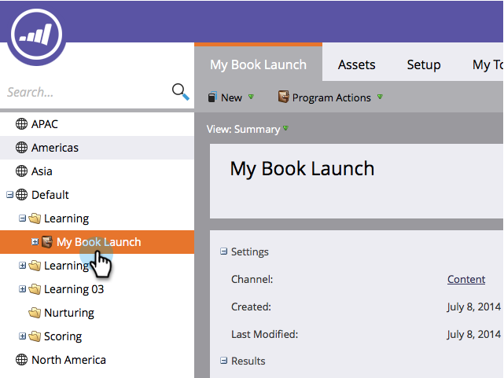

# Remplacement du comportement d’Analytics au niveau du Programme {#override-analytics-behavior-at-the-program-level}

Vous pouvez définir le comportement des [analyses au niveau administrateur sur les canaux](make-a-program-without-a-period-cost-available-in-revenue-explorer-and-analyzers.md) , mais vous pouvez également le remplacer au niveau programme. Voici comment procéder :

1. Accédez à la zone Activités marketing.

   

1. Recherchez et sélectionnez votre programme.

   

1. Sous l’onglet Configuration, faites glisser le comportement Analytics dans la trame.

   

1. Sélectionnez le comportement Analytics que vous souhaitez.

   >[!NOTE]
   >
   >**Définition**
   >
   >* **Inclusif** - Cette option garantit que le programme est disponible pour le rapports dans les analyseurs et explorateurs de recettes, que vous ayez inclus ou non un coût de période.
   >* **Opérationnel** : cette option a pour effet que le programme ne s&#39;affiche ni dans l&#39;explorateur de recettes ni dans les analyseurs.

   >[!NOTE]
   >
   >Le comportement par défaut (si ce paramètre n’est pas appliqué) est que le programme est inclus dans Analytics **UNIQUEMENT s’il y a au moins un coût** de période, même un coûtégal à zéro dollar affecté.

   

1. Cliquez sur ENREGISTRER.

   

Bien joué ! Vous savez maintenant comment remplacer le comportement des analyses au niveau du programme.

>[!NOTE]
>
>**Rappel**
>
>Les modifications prendront effet le lendemain et seront soit rendues disponibles, soit extraites des explorateurs et analyseurs de recettes.

