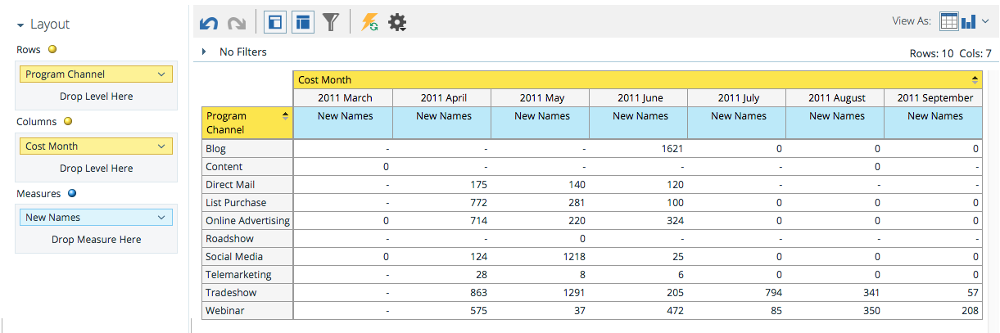

# Présentation de la zone d’analyse du coût du programme {#understanding-the-program-cost-analysis-area}

La zone Analyse des coûts du programme vous permet d’analyser l’efficacité de programmes individuels ou d’afficher des résultats résumés par canal pour une période donnée.

## Exemples de questions commerciales {#example-business-questions}

Combien de nouveaux noms chaque canal a-t-il générés par mois ?

Quel a été mon coût par nouveau nom par canal et par mois ?

Quel pourcentage des nouveaux noms générés a réussi dans un programme ?

Combien ai-je dépensé par programme et par mois ?

## Dimensions et mesures de l&#39;analyse des coûts du programme {#program-cost-analysis-dimensions-and-measures}

>[!NOTE]
>
>Les points jaunes sont des dimensions et les points bleus des mesures.

## Investissement {#investment}

| Mesure | Description |
|---|---|
| Coût par membre | Coût moyen par participant au programme |
| Coût par nouveau nom | Coût moyen par lead acquis par le programme |
| Coût par succès | Coût moyen par lead ayant réussi la progression d’un programme |
| Coût par succès (nouveaux noms) | Coût moyen par lead acquis par le programme ET succès dans la progression du programme |
| Coût du programme | Coût total de la période du programme |

## Adhésion {#membership}

<table>
 <tbody>
  <tr>
   <th>Mesure</th>
   <th>Description</th>
  </tr>
  <tr>
   <td>% nouveaux noms</td>
   <td>Pourcentage de prospects acquis par un programme</td>
  </tr>
  <tr>
   <td>Membres</td>
   <td>Nombre total de leads dans un programme</td>
  </tr>
  <tr>
   <td>Nouveaux noms</td>
   <td>Nombre total de nouveaux noms acquis par un programme</td>
  </tr>
 </tbody>
</table>

## Attributs de programme {#program-attributes}

| Dimension | Description |
|---|---|
| Canal du programme | Canal du programme |
| Nom du programme | Nom du programme |

## Échéancier des coûts du programme {#program-cost-timeframe}

| Dimension | Description |
|---|---|
| Year | Échéancier des coûts du programme |
| Trimestre | Échéancier des coûts du programme |
| Month | Échéancier des coûts du programme |

## Variables du programme {#program-tags}

| Mesure | Description |
|---|---|
| Secteur industriel | Étiquette de programme |
| Ligne de produits | Étiquette de programme |
| Propriétaire du programme | Étiquette de programme |
| Région | Étiquette de programme |

## Réussite {#success}

| Mesure | Description |
|---|---|
| % succès (nouveaux noms) | Pourcentage de leads qui ont été acquis par le programme ET qui ont réussi la progression du programme |
| % succès (total) | Pourcentage de prospects ayant réussi la progression d’un programme |
| Succès (nouveaux noms) | Nombre total de nouveaux noms ayant réussi la progression d&#39;un programme |
| Succès (total) | Nombre total de prospects ayant réussi la progression d’un programme |
