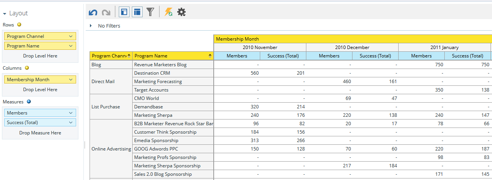

# Présentation de la zone d’analyse de l’abonnement au programme {#understanding-the-program-membership-analysis-area}

La zone Analyse de l’appartenance à un programme vous permet d’analyser l’efficacité de programmes individuels ou d’afficher des résultats résumés par canal pour une période donnée.

## Exemples de questions commerciales {#example-business-questions}

Combien de personnes ont participé à une émission par chaîne au cours d’un mois donné ?

Combien de personnes ont atteint les critères de réussite pour un programme donné ?

Combien de nouveaux noms chaque programme/canal a-t-il générés par mois ?

## Dimensions et mesures de l’analyse de l’appartenance à un programme {#program-membership-analysis-dimensions-and-measures}

>[!NOTE]
>
>Les points jaunes sont des dimensions et les points bleus des mesures.

### Adhésion {#membership}

| Mesure | Description |
|---|---|
| % nouveaux noms | Pourcentage de leads acquis dans un programme |
| Membres | Nombre total de leads dans un programme |
| Nouveaux noms | Nombre total de nouveaux noms acquis par un programme |

### Attributs de programme {#program-attributes}

| Dimension | Description |
|---|---|
| Canal du programme | Canal du programme |
| Nom du programme | Nom du programme |

### Calendrier d’adhésion au programme {#program-membership-timeframe}

| Dimension | Description |
|---|---|
| Year | Échéancier de l’appartenance à un programme |
| Trimestre | Échéancier de l’appartenance à un programme |
| Month | Échéancier de l’appartenance à un programme |
| Semaine | Échéancier de l’appartenance à un programme |
| Date | Échéancier de l’appartenance à un programme |

### Réussite {#success}

| Mesure | Description |
|---|---|
| % succès (nouveaux noms) | Pourcentage de leads qui ont été acquis par le programme ET qui ont réussi la progression du programme |
| % succès (total) | Pourcentage de prospects ayant réussi la progression d’un programme |
| Succès (nouveaux noms) | Nombre total de nouveaux noms ayant réussi la progression d&#39;un programme |
| Succès (total) | Nombre total de prospects ayant réussi la progression d’un programme |
