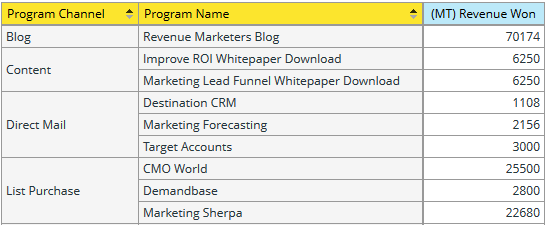
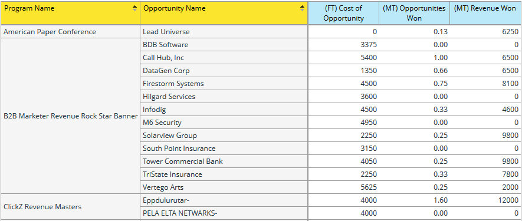

# Comprendre la zone d’analyse des opportunités du programme {#understanding-the-program-opportunity-analysis-area}

## Vue d’ensemble {#overview}

La zone Analyse des opportunités du programme vous permet d’analyser l’efficacité de programmes individuels ou d’afficher des résultats résumés par canal de programme.

**Voici quelques exemples de questions commerciales auxquelles vous pouvez répondre à l’aide de cette zone d’analyse**

Combien d&#39;opportunités ont été associées à un programme donné et combien d&#39;opportunités avons-nous gagnées ?

Quel chiffre d’affaires un programme ou un canal donné a-t-il contribué à générer ?

Quel est mon chiffre d’affaires en investissement pour un programme ou un canal donné ?

Quelles opportunités un programme donné a-t-il influencées ?

## Mesures D’Attribution De L’Analyse Des Opportunités Du Programme (Points Bleus) {#program-opportunity-analysis-attribution-measures-blue-dots}

Les mesures que vous pouvez utiliser dans une analyse sont généralement des nombres et sont représentées par des points bleus. Les dimensions sont des attributs qui donnent différentes vues des mesures et sont représentées par des points jaunes.

Toutes les mesures (points bleus) se rapportent à l’attribution, c’est-à-dire au « crédit » attribué à l’acquisition d’un prospect ou au succès commercial associé à un prospect.

 

Il existe trois types de mesures :

* Mesures liées à l’acquisition, qui obtiennent l’attribution Première touche (FT).
* Les mesures liées à la réussite, qui reçoivent une attribution multipoint (MT).
* Diverses mesures liées au programme, y compris le nombre moyen de contacts marketing avant la création ou la fermeture d’opportunités.

## Mesures liées à l’acquisition et à la réussite {#acquisition-and-success-related-measures}

Les mesures liées à l’acquisition font honneur au programme grâce auquel les coordonnées d’un prospect sont obtenues pour la première fois. Un prospect n&#39;a pas besoin de réussir dans un programme pour obtenir un crédit d&#39;acquisition.

La valeur d’acquisition d’un prospect donné change au fil du temps. C’est zéro jusqu’à ce que le prospect effectue un achat. Il peut ensuite augmenter avec les achats supplémentaires.

Les mesures liées à la réussite reconnaissent tous les programmes qui contribuent à la progression d’un prospect vers un achat.

Comme pour l’acquisition, la valeur de la contribution aux ventes réalisées pour un prospect change au fil du temps et est nulle jusqu’à ce que le prospect effectue un achat.

<table>
 <tbody>
  <tr>
   <th>Mesure d’attribution - liée à l’opportunité (FT ou MT)*</th>
   <th>Description</th>
  </tr>
  <tr>
   <td>Coût d’opportunité</td>
   <td>La partie du coût du programme qui a influencé l’opportunité. Le coût peut être fractionné s’il y a plusieurs prospects impliqués.</td>
  </tr>
  <tr>
   <td>Opportunités créées</td>
   <td>Partie du crédit que le programme a reçu pour avoir influencé la création de l’opportunité. Il peut s’agir d’une fraction si plusieurs leads étaient impliqués.</td>
  </tr>
  <tr>
   <td>Opportunités confirmées</td>
   <td>Portion du crédit reçue par le programme pour avoir influencé l’opportunité gagnée. Il peut s’agir d’une fraction si plusieurs leads étaient impliqués.</td>
  </tr>
  <tr>
   <td>Pipeline créé</td>
   <td>La part de crédit (en valeur monétaire) reçu par le programme pour avoir influencé la création de l’opportunité. Il peut s’agir d’une fraction si plusieurs leads étaient impliqués.</td>
  </tr>
  <tr>
   <td>Pipeline créé - toujours ouvert</td>
   <td>La part de crédit (en valeur monétaire) reçu par le programme pour avoir influencé la création de l’opportunité ouverte actuellement. Il peut s’agir d’une fraction si plusieurs leads étaient impliqués.</td>
  </tr>
  <tr>
   <td>Chiffre d’affaires attendu</td>
   <td>La part de crédit (en valeur monétaire) reçu par le programme pour avoir influencé la création de l’opportunité. Le chiffre d’affaires attendu correspond à la probabilité d’opportunité multipliée par la valeur de l’opportunité. Il peut s’agir d’une fraction si plusieurs leads étaient impliqués.</td>
  </tr>
  <tr>
   <td>Recettes Vers Investissement</td>
   <td>Il s’agit du rapport entre la part de crédit (en valeur monétaire) reçu par le programme pour avoir influencé les opportunités confirmées et le coût du programme.</td>
  </tr>
  <tr>
   <td>Chiffre d’affaires confirmé</td>
   <td>La part de crédit (en valeur monétaire) reçu par le programme pour avoir influencé l’opportunité confirmée. Il peut s’agir d’une fraction si plusieurs leads étaient impliqués.</td>
  </tr>
 </tbody>
</table>

_&#42;(FT) = Attribution du premier contact, utilisée pour les mesures de l’acquisition du prospect ; (MT) = Attribution multicontact, utilisée pour les mesures de la réussite du prospect_

Vous trouverez ci-dessous un scénario qui décrit comment les unités d’opportunité sont calculées lorsqu’il existe deux programmes qui ont généré des prospects, mais que ces prospects ont abouti à une seule opportunité à partir du même compte.

**Programme 1**

* Génère un lead : Lead 1
* Le lead 1 provient du compte 1

**Programme 2**

* Génère un autre lead : Lead 2
* Le lead 2 provient également du compte 1

**Compte 1**

* Génère une opportunité : opportunité 1

Marketo attribue les crédits de manière appropriée sans comptabiliser deux fois les opportunités entre les programmes. Ainsi, dans ce cas, chaque programme reçoit 0,5 unité d’opportunité. Autrement dit, chaque programme reçoit la moitié du crédit pour l’opportunité générée. En outre, la moitié du chiffre d’affaires associé à l’opportunité est affectée à chaque programme.

## Mesures Diverses Liées Au Programme {#miscellaneous-program-related-measures}

Les autres mesures disponibles reflètent la performance globale du programme.

<table>
 <tbody>
  <tr>
   <th>Mesure D’Attribution - Liée Au Programme</th>
   <th>Description</th>
  </tr>
  <tr>
   <td>Nombre d’opportunités associées au programme</td>
   <td>
Nombre total d’opportunités ayant attribué un crédit d’attribution à un programme. Les opportunités peuvent être influencées par un ou plusieurs prospects et par un ou plusieurs programmes.
</td>
  </tr>
  <tr>
   <td>Nombre moyen de succès par opportunité close</td>
   <td>Nombre moyen de succès du programme avant la fermeture de l’opportunité.  </td>
  </tr>
  <tr>
   <td>Nombre moyen de succès par opportunité créée</td>
   <td>Nombre moyen de succès de programmes avant la création de l’opportunité.</td>
  </tr>
  <tr>
   <td>Nouveaux noms</td>
   <td>Nombre total de nouveaux noms, c’est-à-dire de nouveaux prospects, acquis par le programme.</td>
  </tr>
  <tr>
   <td>Coût du programme</td>
   <td>Coût total du programme.</td>
  </tr>
  <tr>
   <td>Succès (total)</td>
   <td>Nombre total de membres du programme qui ont réussi.</td>
  </tr>
 </tbody>
</table>

## Dimensions d’analyse des opportunités du programme (points jaunes) {#program-opportunity-analysis-dimensions-yellow-dots}

Alors que les mesures (points bleus) sont calculées et requièrent une réflexion et une explication, les dimensions (points jaunes) sont descriptives. Voici les dimensions disponibles.

<table>
 <tbody>
  <tr>
   <th>Catégorie</th>
   <th>Afficher l'intitulé</th>
  </tr>
  <tr>
   <td>Attributs d'opportunité</td>
   <td>Opportunité close Nom de l’opportunité* Nom du propriétaire de l’opportunité Étape de l’opportunité Type d’opportunité</td>
  </tr>
  <tr>
   <td>Échéancier de l’opportunité</td>
   <td>Opportunité fermée Année/Trimestre/Mois Opportunité créée Année/Trimestre/Mois</td>
  </tr>
  <tr>
   <td>Attributs de programme</td>
   <td>Canal de programme Nom du programme</td>
  </tr>
  <tr>
   <td>Échéancier des coûts du programme</td>
   <td>Coût par an/trimestre/mois</td>
  </tr>
 </tbody>
</table>

_&#42;Toutes les opportunités qui ont attribué n’importe quel type de crédit d’attribution à un programme. Les opportunités peuvent être influencées par un ou plusieurs prospects et par un ou plusieurs programmes._

>[!MORELIKETHIS]
>
>[Créer un rapport de l’explorateur de revenus](/help/marketo/product-docs/reporting/revenue-cycle-analytics/revenue-explorer/create-a-revenue-explorer-report.md)
