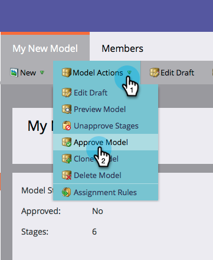
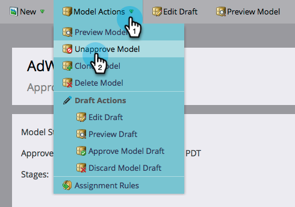
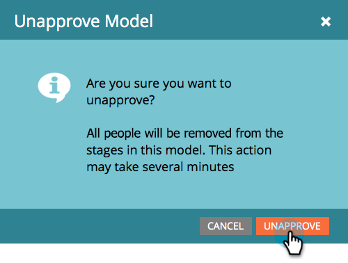

# Approuver/désapprouver un modèle de recettes {#approve-unapprove-a-revenue-model}

Vous ne pouvez avoir qu&#39;un seul modèle approuvé à un moment donné.

>[!CAUTION]
>
>[Les étapes individuelles doivent être ](approving-stages-and-assigning-leads-to-a-revenue-model.md) approuvées et des personnes ajoutées avant d’approuver un modèle entier.

## Approuver {#approve}

1. Accédez à la zone **Analytics**.

   

1. Sélectionnez un modèle dans l&#39;arborescence.

   

1. Dans le menu **Actions du modèle**, choisissez **Approuver le modèle**.

   

1. Une boîte de dialogue s’affiche pour confirmer votre choix. Cliquez sur **Approuver**.

   

Votre modèle est maintenant en ligne !

## Désapprouver {#unapprove}

>[!CAUTION]
>
>Si vous n&#39;approuvez pas votre modèle, toutes vos personnes sont supprimées du modèle, et leur historique dans le modèle est supprimé !

1. Accédez à la zone **Analytics**.

   

1. Sélectionnez un modèle dans l&#39;arborescence.

   

1. Cliquez sur le menu **Actions du modèle** et choisissez **Désapprouver le modèle**.

   

1. Dans la boîte de dialogue qui s’affiche, cliquez sur **Annuler l’approbation du modèle**.

   

Félicitations ! Votre modèle n&#39;est désormais pas approuvé.

>[!CAUTION]
>
>La désapprobation d’un modèle supprime toutes vos personnes du modèle et supprime leur historique dans le modèle de la base de données.

