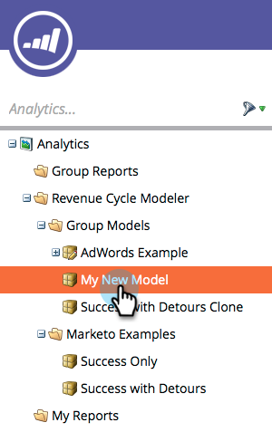
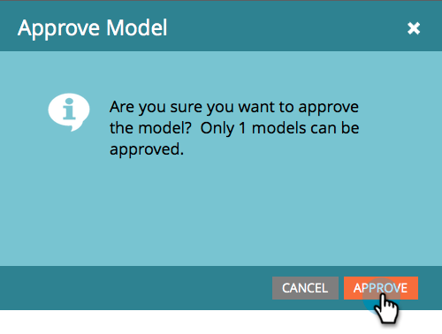
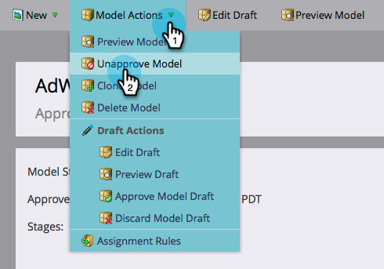
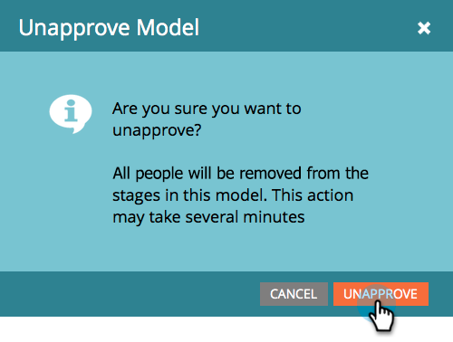

# Approuver/annuler l’approbation d’un modèle de revenu {#approve-unapprove-a-revenue-model}

Vous ne pouvez avoir qu&#39;un seul modèle approuvé à la fois.

>[!CAUTION]
>
>[Les étapes individuelles doivent être approuvées](/help/marketo/product-docs/reporting/revenue-cycle-analytics/revenue-cycle-models/approving-stages-and-assigning-leads-to-a-revenue-model.md) et des personnes doivent être ajoutées avant que vous approuviez un modèle entier.

## Approuver {#approve}

1. Accédez à la zone **[!UICONTROL Analytics]**.

   

1. Sélectionnez un modèle dans l’arborescence.

   

1. Dans le menu **[!UICONTROL Actions du modèle]**, choisissez **[!UICONTROL Approuver le modèle]**.

   

1. Une boîte de dialogue s’affiche pour confirmer votre choix. Cliquez sur **[!UICONTROL Approuver]**.

   

Votre modèle est maintenant en ligne !

## Désapprouver {#unapprove}

>[!CAUTION]
>
>Si vous désapprouvez votre modèle, toutes vos personnes sont supprimées du modèle et leur historique dans le modèle est supprimé.

1. Accédez à la zone **[!UICONTROL Analytics]**.

   

1. Sélectionnez un modèle dans l’arborescence.

   

1. Cliquez sur le menu **[!UICONTROL Actions du modèle]** et choisissez **[!UICONTROL Désapprouver le modèle]**.

   

1. Dans la boîte de dialogue [!UICONTROL Désapprouver le modèle] qui s’affiche, cliquez sur **[!UICONTROL Désapprouver]**.

   

Félicitations ! Votre modèle n&#39;est pas approuvé.

>[!CAUTION]
>
>L&#39;annulation de l&#39;approbation d&#39;un modèle supprime toutes vos personnes du modèle et supprime leur historique dans le modèle de la base de données.
