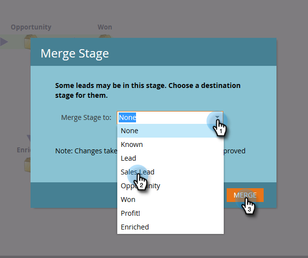

# Modification de votre modèle approuvé {#editing-your-approved-model}

## Modification de votre modèle {#editing-your-model}

1. Sélectionnez le modèle sur lequel vous souhaitez apporter des modifications dans la section Analytics et cliquez sur **Modifier le brouillon**.

   

1. Vous ne pouvez pas supprimer des étapes lors de la modification d&#39;un modèle de brouillon (une fois le modèle approuvé). Vous pouvez à la place fusionner cette scène avec une autre dans le modèle. Cliquez avec le bouton droit sur l’étape à fusionner, puis cliquez sur **Fusionner**.

   

1. Choisissez la nouvelle étape pour les pistes actuellement dans celle sélectionnée ou sélectionnez **Aucune **pour supprimer les pistes de votre modèle. Lorsque vous avez terminé, cliquez sur **Fusionner**.

   

1. Une fois les modifications apportées au modèle, réapprouvez-le en sélectionnant **Approuver le brouillon du modèle** dans le menu **Actions du modèle**.

   

   >[!TIP]
   >
   >Si vous apportez des modifications à vos étapes, telles que leur ajout ou leur fusion, veillez à modifier vos règles d&#39;affectation et vos phases afin de refléter vos modifications.

## Annulation de l&#39;approbation de votre modèle {#unapproving-your-model}

>[!CAUTION]
>
>Si vous désapprouvez votre modèle, tous ses prospects sont supprimés et leur historique dans le modèle est supprimé. Envisagez de modifier votre modèle au lieu de le désapprouver.

1. Sélectionnez le modèle que vous souhaitez désapprouver. Dans le menu **Actions du modèle**, sélectionnez **Désapprouver le modèle**.

   

1. Cliquez sur **Désapprouver**.

   

>[!NOTE]
>
>Si vous souhaitez réapprouver ce modèle, vous devez d&#39;abord réaffecter les pistes aux étapes.

## Création d&#39;autres modèles {#creating-more-models}

Vous ne pouvez avoir qu&#39;un seul modèle approuvé à la fois. Si vous souhaitez approuver un modèle mais en avoir déjà un approuvé, vous devez d’abord désapprouver votre modèle actuel. Si possible, essayez de modifier votre modèle au lieu d&#39;en créer un nouveau.

>[!MORELIKETHIS]
>
>[Créer un modèle de recettes](../../../../../product-docs/reporting/revenue-cycle-analytics/revenue-cycle-models/create-a-new-revenue-model.md)

