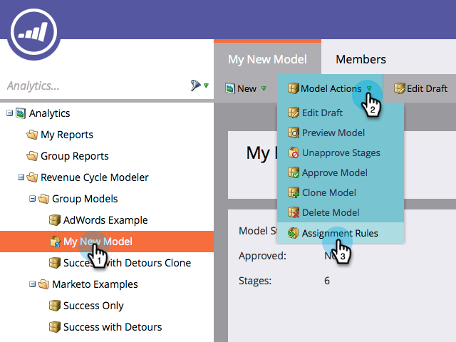

# Approbation d&#39;étapes et affectation de pistes à un modèle de recettes {#approving-stages-and-assigning-leads-to-a-revenue-model}

Exécutez votre **modèle** de recettes **** en ajoutant des pistes existantes, en créant des règles d&#39;affectation pour toutes les nouvelles pistes.

## Approbation des étapes {#approving-stages}

Approuvons les étapes de votre modèle avant d&#39;ajouter des pistes.

1. Accédez à la **zone **Analytics.** **

   

1. Sélectionnez le modèle dont vous souhaitez approuver les étapes.

   

1. Sous Actions **** du modèle, sélectionnez **Approuver** **les étapes**.

   

1. Vous serez accueilli avec une alerte ; cliquez sur **Attribuer des pistes**.

   

Excellent ! Passons à autre chose et affectons ces pistes.

## Affectation de pistes existantes {#assigning-existing-leads}

[Créez une Liste](../../../../product-docs/core-marketo-concepts/smart-lists-and-static-lists/creating-a-smart-list/create-a-smart-list.md) dynamique pour identifier les pistes pour une étape de votre modèle dans votre base de données de pistes.

1. Une fois que vous avez [créé votre Liste](../../../../product-docs/core-marketo-concepts/smart-lists-and-static-lists/creating-a-smart-list/create-a-smart-list.md)dynamique, cliquez sur l’onglet **Pistes** .

   

1. Cliquez sur **Sélectionner tout** pour sélectionner les pistes.

   

1. Ouvrez la liste déroulante Actions **de** piste et sélectionnez **Spécial**. Cliquez sur **Modifier l’étape** des recettes.

   

1. Sélectionnez le **modèle** correct et la **phase** appropriée. Cliquez sur **Exécuter maintenant**.

   

1. Répétez cette opération jusqu&#39;à ce que toutes vos pistes soient affectées aux différentes étapes de votre modèle.

Super ! Pour spécifier comment de nouvelles pistes sont affectées aux étapes, créez des règles d&#39;affectation.

>[!NOTE]
>
>Si votre modèle est à l&#39;état Etapes approuvées, aucun événement d&#39;étape Modifier les recettes ne s&#39;affichera dans les journaux d&#39;activité des pistes. Si votre modèle est entièrement approuvé, cette étape de flux sera ignorée si vous déplacez une piste dans la même étape qu&#39;elle est actuellement.

## Nouvelles pistes : Créer des règles d&#39;affectation  {#new-leads-create-assignment-rules}

1. Cliquez à nouveau sur** Accueil du marketing**, puis sélectionnez **Analytics**.

   

1. `Click your model in the tree, then the`**`Model Actions`**`menu, selecting`**`Assignment Rules`** `.`

   

1. `If your assignment rules contain more than just one default choice click **Stage, **make your selection, then click`**`Add Choice`**`.`

   

## Exemple de règle d&#39;affectation {#example-assignment-rule}

Créez une règle Score de piste pour affecter les nouvelles pistes avec un score minimum à une étape appropriée.

1. Sous **Si**, sélectionnez Score de **piste**. Choisissez ensuite **au moins**.
` 

   `

1. Saisissez **40** dans le champ et sélectionnez **Sales Lead** as a Stage (Pistecommerciale). Cliquez sur **Enregistrer** pour terminer.

   

>[!NOTE]
>
>**Articles connexes**
>
>Pour approuver votre modèle, lisez notre page d&#39;aide sur ** [Approbation et désapprobation d&#39;un modèle](approve-unapprove-a-revenue-model.md)de recettes**.

