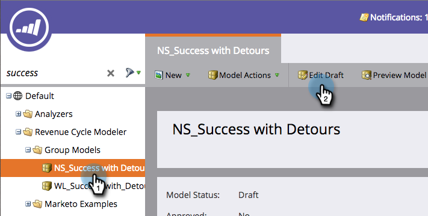

# Modification du nom d’une étape {#changing-the-name-of-a-stage}

Changez d&#39;avis ? Pas un problème. Il est facile de renommer une étape dans le modèle de cycle des recettes.

1. Accédez au **Analytics** zone.

   

1. Sélectionnez un modélisateur de cycle des recettes à mettre à jour. Cliquez sur **Modifier le brouillon**.

   

1. Sélectionnez l’étape à mettre à jour et saisissez une nouvelle étape. **Nom**.

   

1. Cliquez sur **Fermer**.

   

   Vous voyez ? Easy! N’oubliez pas de [Approbation de votre modèle](/help/marketo/product-docs/reporting/revenue-cycle-analytics/revenue-cycle-models/approve-unapprove-a-revenue-model.md).
