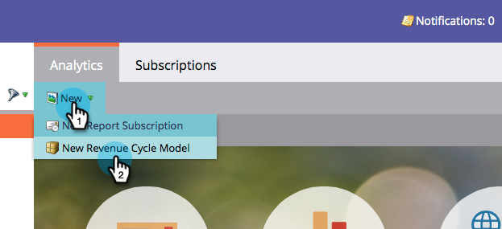
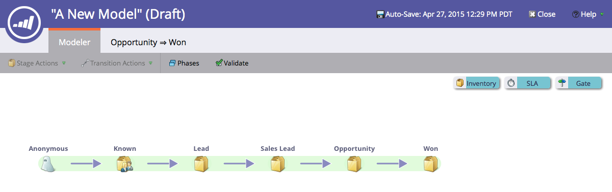

# Créer un modèle de revenu {#create-a-new-revenue-model}

1. Pour créer un modèle de cycle du chiffre d’affaires, cliquez sur le bouton **[!UICONTROL Analytics]** sur l’écran d’accueil de [!UICONTROL Mon Marketo].

   

1. Dans l’onglet **[!UICONTROL Analytics]**, cliquez sur **[!UICONTROL Nouveau]** et sélectionnez **[!UICONTROL Nouveau modèle de cycle du chiffre d’affaires]**.

   

1. Une fenêtre modale **[!UICONTROL Nouveau modèle de cycle du chiffre d’affaires]** s’affiche. Saisissez un nom et cliquez sur **[!UICONTROL Créer]**.

   

1. Cliquez sur **[!UICONTROL Modifier le brouillon]** dans la vue d’accueil de votre modèle.

   

1. Dans la nouvelle fenêtre, un modèle comportant six étapes d’inventaire, cinq transitions entre ces étapes et la possibilité d’ajouter des étapes d’inventaire, de SLA et de point de contrôle vous sera présenté.

   

Elle a l&#39;air affûtée ! Vous venez d&#39;entrer dans le monde merveilleux de la modélisation.

>[!MORELIKETHIS]
>
>En savoir plus sur [Utilisation des étapes d’inventaire du modèle de revenu](/help/marketo/product-docs/reporting/revenue-cycle-analytics/revenue-cycle-models/using-revenue-model-inventory-stages.md).
