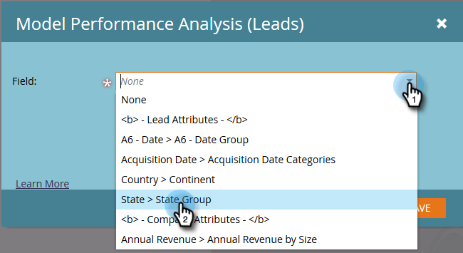

# Activation des groupes de champs personnalisés pour l’analyse des performances des modèles (Leads) {#enable-custom-field-groups-for-model-performance-analysis-leads}

>[!PREREQUISITES]
>
>Classez les champs standard ou personnalisés en groupes pour la création de rapports via l’Organiseur de champs de Marketo. Pour plus d’informations, voir [Création de groupes de champs personnalisés via l’Organiseur de champs](/help/marketo/product-docs/reporting/revenue-cycle-analytics/revenue-tools/field-organizers/create-custom-field-groups-using-the-field-organizer.md).

<table> 
 <tbody> 
  <tr> 
   <td colspan="3" rowspan="1">
<strong>Comment l’activation d’un groupe de champs personnalisé affecte-t-elle plusieurs zones d’analyse dans l’explorateur de cycles de revenus ?</strong>
</td> 
  </tr> 
  <tr> 
   <td colspan="1" rowspan="1">
<strong>Que se passe-t-il quand... ?</strong>
</td> 
   <td colspan="1" rowspan="1">
<strong>Incidence sur la zone d’analyse des performances du modèle (Leads)</strong>
</td> 
   <td colspan="1" rowspan="1">
<strong>Incidence sur l’analyse des pistes, l’analyse des campagnes et les analyses des opportunités</strong>
</td> 
  </tr> 
  <tr> 
   <td colspan="1" rowspan="1">
<strong>Que se passe-t-il lorsque vous activez un groupe de champs personnalisé associé à un champ de prospect ou d’entreprise standard ?</strong>
</td> 
   <td colspan="1" rowspan="1">
Le groupe de champs personnalisé est activé pour la création de rapports dans la zone d’analyse des performances du modèle (Leads).
</td> 
   <td colspan="1" rowspan="1">
Aucun impact
</td> 
  </tr> 
  <tr> 
   <td colspan="1" rowspan="1">
<strong>Que se passe-t-il lorsque vous activez un groupe de champs personnalisé associé à un champ de personne ou d’entreprise personnalisé ?</strong>
</td> 
   <td colspan="1" rowspan="1">
Le groupe de champs personnalisé est activé pour la création de rapports dans la zone d’analyse des performances du modèle (Leads).
</td> 
   <td colspan="1" rowspan="1">
Le champ personnalisé lui-même est activé pour la création de rapports dans les zones Analyse de piste, Analyse de campagne et Analyse des opportunités .

<strong>REMARQUE :</strong> Les groupes de champs personnalisés ne sont PAS pris en charge dans ces zones d’analyse. Par conséquent, les associations de groupes ne s’affichent pas dans l’Explorateur du cycle de revenu.<em>uniquement</em> le champ personnalisé.
</td> 
  </tr> 
 </tbody> 
</table>

Pour activer un groupe de champs personnalisé pour la création de rapports dans la zone d’analyse des performances du modèle (Leads), procédez comme suit.

1. Cliquez sur **Admin**.

   

1. Cliquez sur **Revenue Cycle Analytics**.

   

1. Cliquez sur **Aucun** en regard d’un groupe de champs vide. Si trois groupes de champs sont déjà activés et que vous souhaitez effectuer une modification, cliquez sur le nom du groupe de champs que vous souhaitez modifier.

   

1. Cliquez sur la liste déroulante **Field** et sélectionnez celui qui vous intéresse.

   

   >[!NOTE]
   >
   >Cet exemple a activé un groupe de champs personnalisé pour un champ standard (état). Par conséquent, seule la zone d’analyse des performances du modèle (Leads) a été affectée. Si un groupe de champs personnalisé pour un champ personnalisé de personne ou d’entreprise avait été activé, le groupe activé s’afficherait dans la section Analyse des performances du modèle (Leads) de l’onglet Synthèse de synchronisation et le nombre de champs personnalisés pour l’analyse des pistes, des campagnes et des opportunités augmenterait d’une unité.

1. Cliquez sur **Enregistrer**.

   
