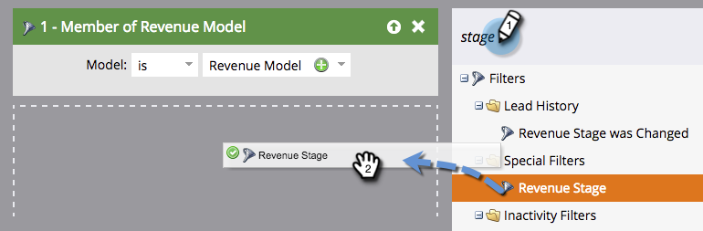

# Rechercher tous les leads dans un modèle de cycle de revenu {#find-all-leads-in-a-revenue-cycle-model}

En utilisant des listes intelligentes, vous pouvez facilement trouver tous les membres du modèle de cycle du chiffre d’affaires.

>[!PREREQUISITES]
>
>[Créer une liste dynamique](/help/marketo/product-docs/core-marketo-concepts/smart-lists-and-static-lists/creating-a-smart-list/create-a-smart-list.md)

1. Lorsque la liste dynamique est sélectionnée, cliquez sur l’onglet **[!UICONTROL Liste dynamique]**.

   

1. Recherchez le filtre **[!UICONTROL Membre du modèle de chiffre d’affaires]** et faites-le glisser dans la zone de travail.

   

1. Sélectionnez un **[!UICONTROL modèle]**.

   

   Cela vous permettrait d’obtenir toutes les pistes de ce modèle, quelle que soit l’étape. En règle générale, vous souhaiterez une étape spécifique. Utilisez plutôt le filtre suivant.

1. Recherchez le filtre **[!UICONTROL Étape de chiffre d’affaires]** et faites-le glisser dans la zone de travail.

   

1. Sélectionnez une **[!UICONTROL Phase]**.

   

1. Accédez à l’onglet **[!UICONTROL Leads]** pour afficher les résultats.

   

   >[!TIP]
   >
   >Vous n’avez pas besoin des deux filtres, choisissez simplement celui dont vous avez besoin. Nous vous montrons à tous les deux qu&#39;ils sont minutieux.

   >[!CAUTION]
   >
   >Si l’étape d’un prospect est modifiée par une campagne externe lors de sa création initiale, aucune activité n’est consignée dans la base de données. Cela signifie que le prospect ne sera pas inclus par le filtre de liste dynamique.
