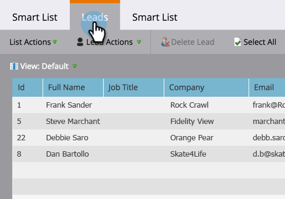

# Rechercher toutes les pistes dans un modèle de cycle de revenus {#find-all-leads-in-a-revenue-cycle-model}

En utilisant des listes intelligentes, vous pouvez facilement trouver tous les membres du modèle de cycle de recettes.

>[!PREREQUISITES]
>
>[Création d’une Liste dynamique](../../../../product-docs/core-marketo-concepts/smart-lists-and-static-lists/creating-a-smart-list/create-a-smart-list.md)

1. Une fois la liste intelligente sélectionnée, cliquez sur l&#39;onglet **Liste intelligente**.

   

1. Recherchez le filtre **Membre du modèle de revenu** et faites-le glisser dans le canevas.

   

1. Sélectionnez un **modèle**.

   

   Cela vous donnerait toutes les pistes dans ce modèle, quelle que soit la scène. En général, vous souhaitez une étape spécifique. Utilisez plutôt le filtre suivant.

1. Recherchez le **stade Recettes **filtre et faites-le glisser dans le canevas.

   

1. Sélectionnez une étape ****.

   

1. Accédez à l&#39;onglet **Pistes** pour vue les résultats.

   

   >[!TIP]
   >
   >Vous n&#39;avez pas besoin des deux filtres, il vous suffit de choisir celui dont vous avez besoin. Nous vous montrons tous les deux d&#39;être minutieux.    >

   >[!CAUTION]
   >
   >Si l&#39;étape d&#39;une piste est modifiée par une campagne externe lors de la création initiale de la piste, une activité n&#39;est pas enregistrée dans la base de données. Cela signifie que le prospect ne sera pas inclus par le filtre de liste dynamique.

