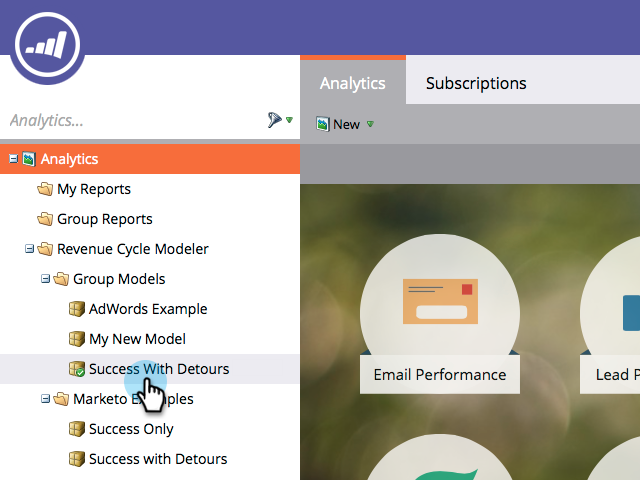

# Fusion de deux étapes dans le Modeler des recettes {#merging-two-stages-in-the-revenue-modeler}

Après avoir approuvé le modèle, vous ne pouvez pas supprimer les étapes lors de la modification d’un brouillon. Vous pouvez à la place fusionner cette scène avec une autre.

1. Cliquez sur **Marketo Home** et sélectionnez **Analytics**.

   

1. Cliquez sur votre modèle approuvé.

   

1. Cliquez sur **Modifier le brouillon.**

   

1. Cliquez avec le bouton droit de la souris sur l’étape à fusionner, puis sélectionnez **Fusionner l’étape** dans le menu.

   

1. Cliquez sur l’étape spécifique dans la liste déroulante.

   

1. Vous pouvez réapprouver le modèle en sélectionnant **Approuver le brouillon du modèle** dans le menu **Actions du modèle** .

   

>[!NOTE]
>
>Sélectionnez **None** dans la liste déroulante Étape de fusion pour supprimer les pistes de votre modèle.
