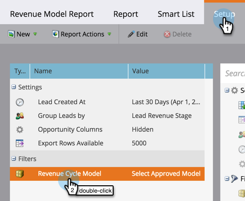

# Créer un rapport sur votre modèle de revenu {#report-on-your-revenue-model}

Pour chaque modèle de cycle de chiffre d’affaires, vous pouvez générer un rapport sur le nombre de prospects à chaque étape.

>[!NOTE]
>
>Les prospects doivent être membres du modèle à inclure dans le rapport.

1. Accédez à **[!UICONTROL Analytics]**.

   

1. Cliquez sur **[!UICONTROL Leads par étape de chiffre d’affaires]**.

   

1. Cliquez sur l’onglet **[!UICONTROL Configuration]** puis, sous la section de filtre, double-cliquez sur **[!UICONTROL Modèle de cycle de chiffre d’affaires]**.

   

1. Sélectionnez le **[!UICONTROL modèle]** approuvé.

   

   >[!NOTE]
   >
   >Pour être accessible à partir de ce menu déroulant, le modèle doit être approuvé ou au moins comporter des étapes approuvées.

1. Cliquez sur l’onglet **[!UICONTROL Rapport]** pour voir le nombre de prospects à chaque étape de votre modèle de cycle de revenus.

   

Pourquoi est-ce utile ? Le modèle présente votre funnel de ventes et de marketing. Suivez leurs soldes au fil du temps pour identifier les goulots d&#39;étranglement avant qu&#39;ils ne deviennent un problème.
