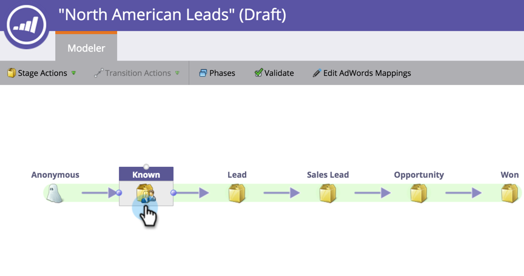

# Définir des conversions Google AdWords dans le modèle de revenu avec un compte de gestionnaire {#set-google-adwords-conversions-in-the-revenue-model-with-a-manager-account}

Liez votre compte Google AdWords à Marketo pour charger automatiquement les données de conversion hors ligne de Marketo vers Google AdWords. Ensuite, à partir de l’interface utilisateur d’AdWords, vous pourrez facilement voir quels clics ont généré des prospects qualifiés, des opportunités et de nouveaux clients (ou toute étape de recettes dont vous souhaitez effectuer le suivi) après avoir [ajouté des colonnes personnalisées](https://support.google.com/adwords/answer/3073556) dans AdWords.

Si vous disposez de plusieurs comptes Google AdWords Manager, vous pouvez utiliser un [compte Google AdWords Manager](https://www.google.com/adwords/manager-accounts/) (anciennement appelé My Client Center) pour les intégrer à Marketo.

Vous pouvez mapper des conversions hors ligne AdWords à une ou plusieurs scènes dans un modèle Recettes. Il existe deux façons :

* Action d’évaluation
* Mappage AdWords

>[!PREREQUISITES]
>
>[Ajout de Google AdWords en tant que service Launch avec un compte de gestionnaire](/help/marketo/product-docs/administration/additional-integrations/add-google-adwords-as-a-launchpoint-service-with-a-manager-account.md)

## Utilisation d’une action d’étape {#use-stage-action}

Mappage d’une conversion AdWords sous Actions intermédiaires

1. Sélectionnez l’étape à mapper à une conversion AdWords.

   

1. Dans la liste déroulante **Actions intermédiaires**, sélectionnez **Définir la conversion AdWords**.

   

1. Définissez une **conversion AdWords**.

   >[!NOTE]
   >
   >Une conversion AdWords différente peut être sélectionnée pour chaque compte enfant.

   

   Conseil : Si vous n’avez aucune conversion AdWords, créez-en une en cliquant sur **+Nouvelle conversion**.

   

1. Cliquez sur **Enregistrer**.

   

1. Une fois le mappage de toutes vos conversions AdWords aux phases de recettes terminé, revenez à la page de résumé. Sélectionnez **Actions de modèle** et choisissez **Approuver les étapes**.

   

## Conseil : Ajouter une nouvelle conversion {#pro-tip-add-a-new-conversion}

Conseil professionnel ! Une nouvelle conversion hors ligne AdWords peut être créée à partir de Marketo.

>[!CAUTION]
>
>Le paramètre &quot;optimisation&quot; est activé pour les nouvelles conversions créées à partir de Marketo. Cela signifie que les stratégies d’offres AdWords sont autorisées à optimiser vos offres pour ces conversions. Vous pouvez modifier ce paramètre à partir de votre compte AdWords.

1. Dans la liste déroulante **Actions intermédiaires**, sélectionnez **Définir la conversion AdWords**.

   

1. Sélectionnez **Nouvelle conversion**.

   

1. Saisissez un **Nom de conversion**. Cliquez sur **Enregistrer**.

   

   Excellent ! Cette nouvelle conversion apparaîtra dans votre compte AdWords.

## Utilisation du mappage AdWords {#use-adwords-mapping}

Vous pouvez associer toutes vos scènes de modèle à votre conversion AdWords à un seul emplacement à l’aide des mappages AdWords.

1. Sélectionnez **Modifier les mappages AdWords**.

   

1. Sélectionnez le **compte AdWords** de votre choix et la **conversion AdWords** de chaque étape dont vous souhaitez effectuer le suivi.

   

1. Une fois que vous avez mappé vos scènes, cliquez sur **Enregistrer**.

   

1. Une fois le mappage de toutes vos conversions AdWords aux phases de recettes terminé, revenez à la page de résumé. Sélectionnez **Actions de modèle** et choisissez **Approuver les étapes**.

   

Pour afficher les données de conversion hors ligne, vous devez vous connecter à votre compte AdWords. Nous vous recommandons d’utiliser leur [fonction Colonnes personnalisées](https://support.google.com/adwords/answer/3073556) pour créer des colonnes de nombre de conversions pour chaque conversion hors ligne que vous importez à partir de Marketo.
