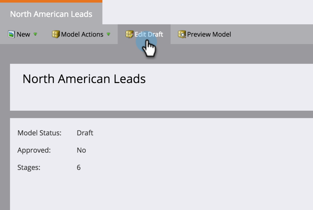

# Définir les conversions AdWords Google dans le modèle de revenu {#set-google-adwords-conversions-in-the-revenue-model}

Liez votre compte Google AdWords à Marketo pour charger automatiquement les données de conversion hors ligne de Marketo vers Google AdWords. Ensuite, à partir de l’interface utilisateur d’AdWords, vous pourrez facilement voir quels clics ont généré des prospects qualifiés, des opportunités et de nouveaux clients (ou toute étape de recettes dont vous souhaitez effectuer le suivi) après avoir [ajouté des colonnes personnalisées](https://support.google.com/adwords/answer/3073556) dans AdWords.

>[!NOTE]
>
>Il s’agit d’une intégration push de Marketo vers Google AdWords. Les données de conversion apparaîtront _uniquement_ sur votre portail Google AdWords, _et non dans l’interface utilisateur de Marketo_.

En savoir plus sur la [fonctionnalité d’importation de conversion hors ligne de Google](https://support.google.com/adwords/answer/2998031?hl=en). Mappez les conversions hors ligne AdWords à une ou plusieurs scènes d’un modèle Recettes. Le mappage peut être effectué de trois façons :

* Conversion AdWords
* Action d’évaluation
* Mappage AdWords

Vous pouvez créer une conversion hors ligne AdWords à partir de Marketo si vous utilisez l’action d’étape.

>[!PREREQUISITES]
>
>[Ajouter Google AdWords as a LaunchPoint Service](/help/marketo/product-docs/administration/additional-integrations/add-google-adwords-as-a-launchpoint-service.md)

## Utiliser la conversion AdWords {#use-adwords-conversion}

1. Accédez à la zone **Analytics**.

   

1. Sélectionnez un modèle.

   

1. Cliquez sur **Modifier le brouillon**.

   

1. Sélectionnez l’étape des recettes à mapper à une conversion AdWords.

   

1. Sélectionnez la **conversion AdWords** que vous souhaitez mapper à l’étape Marketo.

   

   Beau ! Vos données de conversion AdWords seront chargées dans vos AdWords Google à la vitesse que vous avez sélectionnée.

## Utilisation d’une action d’étape {#use-stage-action}

Vous pouvez également mapper une conversion AdWords sous Actions intermédiaires.

1. Sélectionnez l’étape à mapper à une conversion AdWords.

   

1. Dans la liste déroulante **Actions intermédiaires**, sélectionnez **Définir la conversion AdWords**.

   

1. Sélectionnez une **conversion AdWords**.

   

   **Conseil** : Si vous n’avez aucune conversion AdWords, créez-en une en cliquant sur **+Nouvelle conversion**.

   

1. Cliquez sur **Enregistrer**.

   

1. Une fois le mappage de toutes vos conversions AdWords aux phases de recettes terminé, revenez à la page de résumé. Sélectionnez **Actions de modèle** et choisissez **Approuver les étapes**.

   

## Conseil : Ajouter une nouvelle conversion {#pro-tip-add-a-new-conversion}

Conseil professionnel ! Une nouvelle conversion hors ligne AdWords peut être créée à partir de Marketo.

>[!CAUTION]
>
>Le paramètre &quot;optimisation&quot; est activé pour les nouvelles conversions créées à partir de Marketo. Cela signifie que les stratégies d’offres AdWords sont autorisées à optimiser vos offres pour ces conversions. Vous pouvez modifier ce paramètre à partir de votre compte AdWords.

1. Dans la liste déroulante **Actions intermédiaires**, sélectionnez **Définir la conversion AdWords**.

   

1. Sélectionnez **Nouvelle conversion**.

   

1. Saisissez un **Nom de conversion**. Cliquez sur **Enregistrer**.

   

   Excellent ! Cette nouvelle conversion apparaîtra dans votre compte AdWords.

## Utilisation du mappage AdWords {#use-adwords-mapping}

Vous pouvez associer toutes vos scènes de modèle à votre conversion AdWords à un seul emplacement à l’aide des mappages AdWords.

1. Sélectionnez **Modifier les mappages AdWords**.

   

1. Sélectionnez la **conversion AdWords** de votre choix pour chaque étape dont vous souhaitez effectuer le suivi.

   

1. Une fois que vous avez mappé vos scènes, cliquez sur **Enregistrer**.

   

1. Une fois le mappage de toutes vos conversions AdWords aux phases de recettes terminé, revenez à la page de résumé. Sélectionnez **Actions de modèle** et choisissez **Approuver les étapes**.

   

Pour afficher les données de conversion hors ligne, vous devez vous connecter à votre compte AdWords. Nous vous recommandons d’utiliser leur [fonction Colonnes personnalisées](https://support.google.com/adwords/answer/3073556) pour créer des colonnes de nombre de conversions pour chaque conversion hors ligne que vous importez à partir de Marketo.
