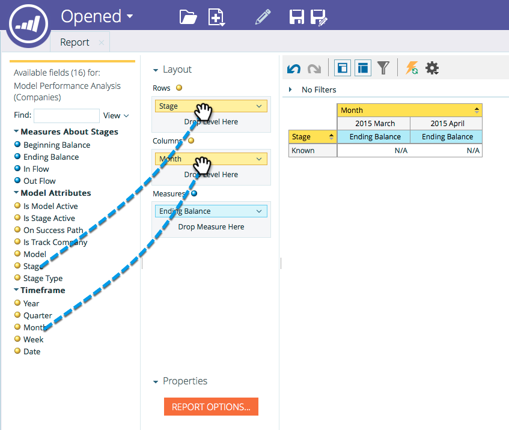

# Démarrage du suivi par compte dans le programme de modélisation des recettes {#start-tracking-by-account-in-the-revenue-modeler}

Grâce au moteur d’évaluation des recettes et à l’Explorateur des recettes, vous pouvez mieux comprendre les performances de vos prospects et comptes au fur et à mesure qu’ils progressent dans votre modèle.

>[!NOTE]
>
>Assurez-vous que votre modèle approuvé comporte des étapes sur le chemin de succès avec **Démarrage du suivi par compte** vérifié

1. Une fois le temps nécessaire pour collecter des données utiles, sélectionnez **Explorateur de recettes** sous le **Ma page d’accueil Marketo**.

   

1. Pour créer un nouveau rapport, cliquez sur **Fichier** et sélectionnez **Nouveau** then **Rapport**.

   

1. Sélectionner **Analyse des performances des modèles (entreprises)** comme zone d’analyse, puis cliquez sur **OK**.

   

1. Il est recommandé de faire glisser le **Évaluation**, **Mois**, et **Solde de fin** pour vous montrer l’évolution des entreprises par mois dans votre modèle. Utilisez les filtres pour sélectionner les mois de votre choix.

   

1. Une fois le rapport configuré, cliquez avec le bouton droit de la souris sur **Is Track Company** et sélectionnez **Filtrer**. Nous l’utiliserons pour limiter le rapport aux seules étapes où **Suivi par compte** est sélectionnée.

   

1. Dans la boîte de dialogue qui s’affiche, sélectionnez Oui et cliquez sur la flèche pointant vers la droite au milieu. Cela filtrera uniquement les étapes pour lesquelles &quot;Suivi par compte&quot; est activé. Cliquez sur **OK** lorsque vous avez fini.

   

1. Votre rapport ne doit maintenant afficher que les étapes dont vous effectuez le suivi par compte. Veillez à enregistrer votre rapport afin de pouvoir l’utiliser ultérieurement. Vous pouvez désormais utiliser ceci comme une autre mesure du succès de vos efforts marketing.
