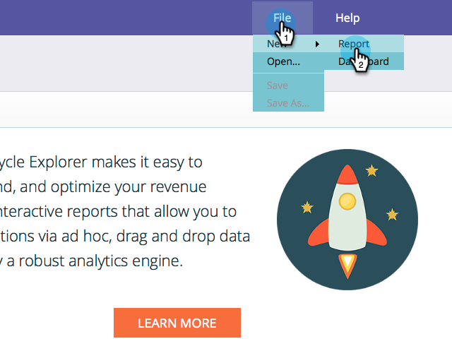

# Suivi de début par compte dans le module de modélisation des recettes {#start-tracking-by-account-in-the-revenue-modeler}

Grâce au module de modélisation des phases des recettes et à l&#39;explorateur de recettes, vous obtenez des informations sur les performances de vos pistes et comptes à mesure qu&#39;ils progressent dans votre modèle.

>[!NOTE]
>
>Assurez-vous que votre modèle approuvé comporte des étapes sur le chemin de réussite avec la vérification du suivi des **Débuts par compte** .

1. Une fois le temps passé pour collecter des données utiles, sélectionnez **Recettes Explorer** sous **Mon marketing d’accueil**.

   

1. Pour créer un rapport, cliquez sur **Fichier** et sélectionnez **Nouveau rapport**,**puis** Rapport.

   

1. Sélectionnez Analyse de performances du **modèle (Sociétés)** comme zone d&#39;analyse et cliquez sur **OK**.

   

1. Nous vous recommandons de faire glisser les champs **Etape**, **Mois** et Solde de **fin** pour vous montrer la progression des sociétés dans votre modèle par mois. Utilisez des filtres pour sélectionner les mois que vous souhaitez.

   

1. Lorsque vous avez terminé de configurer votre rapport, cliquez avec le bouton droit sur **Est une Société** de suivi et sélectionnez **Filtre**. Nous utiliserons cette méthode pour limiter le rapport aux seules étapes où le **suivi par compte** est sélectionné.

   

1. Dans la boîte de dialogue qui s’affiche, sélectionnez Oui, puis cliquez sur la flèche pointant vers la droite au milieu. Ceci ne filtrera que les étapes pour lesquelles l’option &quot;Suivi par compte&quot; est activée. Cliquez sur **OK** lorsque vous avez terminé.

   

1. Votre rapport doit maintenant afficher uniquement les étapes suivies par compte. Veillez à enregistrer votre rapport pour pouvoir l&#39;utiliser ultérieurement. Vous pouvez désormais utiliser cette mesure comme une autre mesure du succès de vos efforts marketing.

