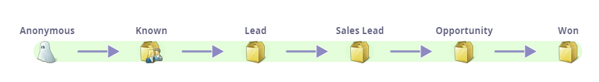

# Présentation des modèles de recettes {#understanding-revenue-models}

Les modèles de cycle de recettes portent le marketing au niveau suivant. Ils modélisent toutes les étapes de l&#39;entonnoir de recettes, depuis le moment où vous interagissez pour la première fois avec une piste jusqu&#39;à ce que la piste soit un client gagné.

## Modèle mental (comment penser à cette chose) {#mental-model-how-to-think-about-this-thing}

Le Modeler est comme une série de seaux avec de l&#39;eau dedans. Il y a des trous dans le fond des seaux.

Le modélisateur mesurera la quantité d&#39;eau (pistes) qui va dans le seau par jour et la quantité qui sort des trous. (Il peut y avoir plusieurs trous)

Le modeleur mesure tous la quantité de pistes dans le compartiment à tout moment. Cela s&#39;appelle l&#39;équilibre des stades.

>[!TIP]
>
>Pour ceux qui ont le plus d&#39;esprit financier, vous pouvez considérer les étapes comme des comptes avec de l&#39;argent qui arrive et sort avec l&#39;équilibre à la fin de chaque journée.

Les modèles s’adressent généralement aux clients qui maîtrisent les campagnes et les programmes intelligents et souhaitent passer à un niveau supérieur d’analyse.

## Commencer avec un nouveau modèle {#starting-with-a-new-model}

Par défaut, un nouveau modèle vous début avec six étapes de recettes. Ce modèle est en fait parfait tout seul, mais il peut être profondément personnalisé.

Remarquez qu&#39;ils sont tous sur un fond vert. Il s’agit du chemin **de** réussite. En savoir plus sur le chemin de réussite [ici](understanding-revenue-model-success-path.md).

**Les étapes** sont les jalons d&#39;une progression vers leurs objectifs.

**Les Transitions **sont présentées sous forme de flèches et elles contrôlent comment les pistes se déplacent entre les étapes.

>[!NOTE]
>
>La scène anonyme est spéciale. Ce sont toutes les personnes qui visitent votre site Web, mais vous n&#39;êtes pas sûr de qui elles sont. Vous ne pouvez pas modifier cette étape.

## Personnalisation {#customization}

Chaque société est différente. Vous pouvez ajouter des éléments au modèle en faisant glisser le curseur depuis le coin supérieur droit.

## Phase de stock {#inventory-stage}

Ça ressemble à une boîte et c&#39;est la phase la plus basique. Analytics suivra les flux entrants, sortants et équilibres de cette étape.

## Phase SLA {#sla-stage}

Il s&#39;agit d&#39;un raccourci pour l&#39;étape de l&#39;accord **de niveau de** service. L&#39;intention ici est que certaines étapes que vous voudrez imposer une limite de temps.

>[!NOTE]
>
>**Exemple**
>
>Lorsqu&#39;un prospect remplit un formulaire &quot;Contactez-moi&quot; et que vous envoyez une alerte à un représentant commercial, vous pouvez souhaiter obtenir un contrat de niveau de service de 72 heures. Vous pourrez suivre les infractions et gronder le représentant pour avoir laissé une bonne piste au secret.

## Étape de la porte {#gate-stage}

Une étape Porte est conçue pour les situations où vous souhaitez filtrer les pistes dans l’un des choix possibles. Il s’agit d’une option avancée. Les débutants doivent éviter les portes.

>[!NOTE]
>
>**Exemple**
>
>Une porte d&#39;entrée peut être utilisée pour les pistes qui font partie d&#39;une liste **de compte** nommée afin de séparer cela du processus normal.

## Transitions {#transitions}

Clarifiez exactement comment une piste passe d&#39;une étape à une autre en utilisant des campagnes intelligentes et assurez-vous que les pistes ne sont bloquées dans aucune étape. Veillez à utiliser des filtres de déclenchement pour les transitions (c’est une façon d’évaluer).

>[!NOTE]
>
>**Exemple**
>
>Une transition peut être définie par un prospect **remplissant un formulaire. **

Voici quelques liens qui peuvent être utilement pleins d&#39;espoir. (ou, espérons-le, utile - prenez votre choix !)

>[!NOTE]
>
>**Articles connexes**
>
>[Créer un modèle de recettes](create-a-new-revenue-model.md)
>
>[Utilisation des étapes du stock du modèle de recettes](using-revenue-model-inventory-stages.md)
>
>[Utilisation des étapes de la porte du modèle de recettes](using-revenue-model-gate-stages.md)
>
>[Utilisation des étapes de l&#39;accord de niveau de service (SLA) du modèle de recettes](using-revenue-model-sla-stages.md)

Ajouter une étape du chemin de réussite heureux   

Lost est un bon à ajouter, mais remarquez qu&#39;il n&#39;est pas sur le chemin vert. C&#39;est parce que ce n&#39;est pas un &quot;succès&quot;.

>[!NOTE]
>
>**Articles connexes**
>
>[Rapport sur votre modèle de recettes](report-on-your-revenue-model.md)
>
>[Approbation/désapprobation d&#39;un modèle de recettes](approve-unapprove-a-revenue-model.md)

