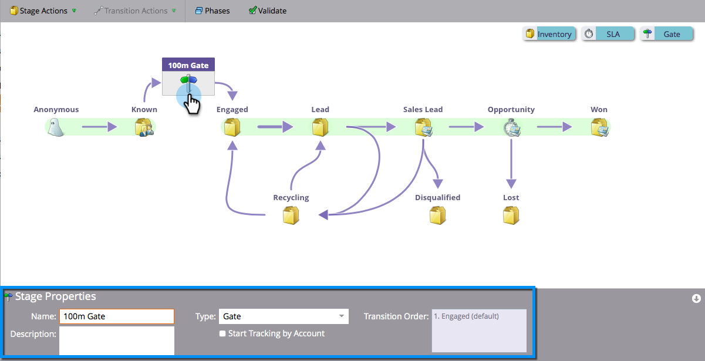

# Utilisation des étapes de la porte du modèle de recettes {#using-revenue-model-gate-stages}

Une étape à la porte sert de vérification de qualification.

>[!TIP]
>
>C&#39;est une bonne idée de créer un modèle pratique dans un programme graphique ou de présentation et de le confirmer avec vos collègues.

## Ajouter une étape de porte {#add-a-gate-stage}

1. Accédez à la zone **Analytics**.

   

1. Sélectionnez un modèle existant ou [créez-en un nouveau](create-a-new-revenue-model.md).

   

1. Cliquez sur **Modifier** **Brouillon**.

   

1. Cliquez sur le bouton **Porte**, puis faites glisser et déposez n’importe où dans la trame.

   

1. Modifiez le **Nom **et sélectionnez un **Type**.

   >[!NOTE]
   >
   >Sélectionnez [Suivi de Début par compte](start-tracking-by-account-in-the-revenue-modeler.md) pour obtenir des informations sur les performances de vos comptes à mesure qu&#39;ils progressent dans votre modèle.

   

>[!NOTE]
>
>La scène de la porte divise les pistes en fonction des critères que vous saisissez dans les règles de transition ; **il ne contient pas de pistes**. Une transition par défaut est requise afin que les pistes qui ne sont pas choisies par les autres transitions finissent par passer par la valeur par défaut.

## Modifier une étape de porte {#edit-a-gate-stage}

Modifiez le nom, la description et le type de l’étape Porte. Vous pouvez également opter pour [suivi de Début par compte](start-tracking-by-account-in-the-revenue-modeler.md).

1. Cliquez sur une icône **Porte** d’étape.

   

1. Cliquez dans les champs **Nom** et **Description** pour modifier leur contenu.

   

1. Sélectionnez la liste déroulante **Type** à modifier.

   

## Supprimer Une Étape De Porte {#delete-a-gate-stage}

1. Vous pouvez supprimer une étape de la porte en cliquant avec le bouton droit de la souris sur l&#39;icône de l&#39;étape de la porte et en sélectionnant **Supprimer**.

   

1. Vous pouvez également supprimer une étape de Porte en cliquant dessus, puis dans la liste déroulante **Actions de l’étape**, en sélectionnant **Supprimer**.

   

1. Les deux méthodes de suppression vous demandent de confirmer votre choix. Cliquez sur **Supprimer**.

   

Félicitations ! Maintenant vous comprenez le monde merveilleux de Gate Stages.

>[!MORELIKETHIS]
>
>* [Utilisation des étapes du stock du modèle de recettes](using-revenue-model-inventory-stages.md)
>* [Utilisation des étapes de l&#39;accord de niveau de service (SLA) du modèle de recettes](using-revenue-model-sla-stages.md)
>* [Créer un modèle](create-a-new-revenue-model.md) de recettes.

>

