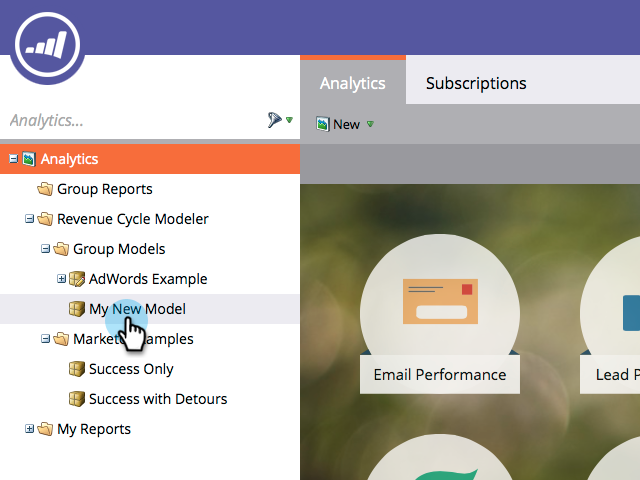

# Utilisation d’étapes de contrôle du modèle de revenu {#using-revenue-model-gate-stages}

Une étape de barrière sert de contrôle de qualification.

>[!TIP]
>
>C&#39;est une excellente idée de créer un modèle pratique dans un programme graphique ou de présentation et de le confirmer avec vos collègues.

## Ajouter Une Étape De Point De Contrôle {#add-a-gate-stage}

1. Accédez à la zone **[!UICONTROL Analytics]**.

   

1. Sélectionnez un modèle existant ou [créez-en un](/help/marketo/product-docs/reporting/revenue-cycle-analytics/revenue-cycle-models/create-a-new-revenue-model.md).

   

1. Cliquez sur **[!UICONTROL Modifier le brouillon]**.

   

1. Cliquez sur le bouton **[!UICONTROL Porte]**, puis effectuez un glisser-déposer n’importe où dans la zone de travail.

   

1. Modifiez le **[!UICONTROL Nom]** et sélectionnez un **[!UICONTROL Type]**.

   >[!NOTE]
   >
   >Sélectionnez [[!UICONTROL Commencer le suivi par compte]](/help/marketo/product-docs/reporting/revenue-cycle-analytics/revenue-cycle-models/start-tracking-by-account-in-the-revenue-modeler.md) pour l’instant afin qu’insight puisse évaluer les performances de vos comptes au fur et à mesure de leur progression dans votre modèle.

   

>[!NOTE]
>
>L’étape de point de contrôle divise les prospects en fonction des critères que vous entrez dans les règles de transition ; **elle ne contient pas de prospects**. Une transition par défaut est requise afin que les prospects qui ne sont pas choisis par les autres transitions finissent par passer par la valeur par défaut.

## Modification d’une étape de point de contrôle {#edit-a-gate-stage}

Modifiez les [!UICONTROL Nom] et [!UICONTROL Description], puis ajustez le [!UICONTROL Type] de votre étape de porte. Vous pouvez également choisir [[!UICONTROL Démarrer le suivi par compte]](/help/marketo/product-docs/reporting/revenue-cycle-analytics/revenue-cycle-models/start-tracking-by-account-in-the-revenue-modeler.md).

1. Cliquez sur une icône d’étape **[!UICONTROL Porte]**.

   

1. Cliquez dans les champs **[!UICONTROL Nom]** et **[!UICONTROL Description]** pour modifier leur contenu.

   

1. Sélectionnez la liste déroulante **[!UICONTROL Type]** à modifier.

   

## Suppression D’Une Étape De Point De Contrôle {#delete-a-gate-stage}

1. Vous pouvez supprimer une étape de grille en cliquant avec le bouton droit sur l’icône de l’étape de grille et en sélectionnant **[!UICONTROL Supprimer]**.

   

1. Vous pouvez également supprimer une étape de point de contrôle en cliquant dessus, puis en sélectionnant **[!UICONTROL Supprimer]** dans le menu déroulant **[!UICONTROL Actions de l’étape]**.

   

1. Les deux méthodes de suppression vous demandent de confirmer votre choix. Cliquez sur **[!UICONTROL Supprimer]**.

   

Félicitations ! Maintenant, vous comprenez le monde merveilleux de Gate Stages.

>[!MORELIKETHIS]
>
>* [Utilisation des étapes d’inventaire du modèle de chiffre d’affaires](/help/marketo/product-docs/reporting/revenue-cycle-analytics/revenue-cycle-models/using-revenue-model-inventory-stages.md)
>* [Utilisation des étapes SLA du modèle de revenu](/help/marketo/product-docs/reporting/revenue-cycle-analytics/revenue-cycle-models/using-revenue-model-sla-stages.md)
>* [Créer un modèle de revenus](/help/marketo/product-docs/reporting/revenue-cycle-analytics/revenue-cycle-models/create-a-new-revenue-model.md).
