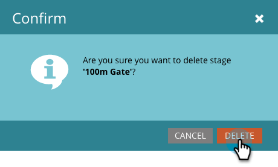

# Utilisation des étapes de point de contrôle du modèle de revenu {#using-revenue-model-gate-stages}

Une étape de point de contrôle sert de vérification de qualification.

>[!TIP]
>
>C&#39;est une bonne idée de créer un modèle pratique dans un programme graphique ou de présentation et de le confirmer avec vos collègues.

## Ajout D’Une Étape De Porte {#add-a-gate-stage}

1. Accédez à la zone **Analytics**.

   

1. Sélectionnez un modèle existant ou [créez-en un](/help/marketo/product-docs/reporting/revenue-cycle-analytics/revenue-cycle-models/create-a-new-revenue-model.md).

   

1. Cliquez sur **Modifier le brouillon**.

   

1. Cliquez sur le bouton **Portail** , puis effectuez un glisser-déposer n’importe où dans la zone de travail.

   

1. Modifiez le **Nom** et sélectionnez un **Type**.

   >[!NOTE]
   >
   >Sélectionnez actuellement [ Commencer le suivi par compte ](/help/marketo/product-docs/reporting/revenue-cycle-analytics/revenue-cycle-models/start-tracking-by-account-in-the-revenue-modeler.md) pour mieux comprendre les performances de vos comptes à mesure qu’ils progressent dans votre modèle.

   

>[!NOTE]
>
>L’étape de la porte divise les pistes en fonction des critères que vous saisissez dans les règles de transition ; **elle ne contient pas de pistes**. Une transition par défaut est requise afin que les pistes qui ne sont pas sélectionnées par les autres transitions finissent par passer par la valeur par défaut.

## Modification d’une étape de portail {#edit-a-gate-stage}

Modifiez le nom, la description et le type de l’étape Portail. Vous pouvez également choisir de [Commencer le suivi par compte](/help/marketo/product-docs/reporting/revenue-cycle-analytics/revenue-cycle-models/start-tracking-by-account-in-the-revenue-modeler.md).

1. Cliquez sur une icône **Porte** de scène.

   

1. Cliquez dans les champs **Nom** et **Description** pour modifier leur contenu.

   

1. Sélectionnez la liste déroulante **Type** à modifier.

   

## Suppression D’Une Étape De Porte {#delete-a-gate-stage}

1. Vous pouvez supprimer une étape de la porte en cliquant avec le bouton droit de la souris sur l’icône de l’étape de la porte et en sélectionnant **Supprimer**.

   

1. Vous pouvez également supprimer une étape de portail en cliquant dessus, puis dans la liste déroulante **Actions intermédiaires**, en sélectionnant **Supprimer**.

   

1. Les deux méthodes de suppression vous demandent de confirmer votre choix. Cliquez sur **Supprimer**.

   

Félicitations ! Maintenant, vous comprenez le monde merveilleux des étapes de portes.

>[!MORELIKETHIS]
>
>* [Utilisation des phases de l’inventaire des modèles de recettes](/help/marketo/product-docs/reporting/revenue-cycle-analytics/revenue-cycle-models/using-revenue-model-inventory-stages.md)
>* [ Utilisation des étapes du contrat de niveau de service du modèle de revenu ](/help/marketo/product-docs/reporting/revenue-cycle-analytics/revenue-cycle-models/using-revenue-model-sla-stages.md)
>* [Créer un modèle de revenu](/help/marketo/product-docs/reporting/revenue-cycle-analytics/revenue-cycle-models/create-a-new-revenue-model.md).
