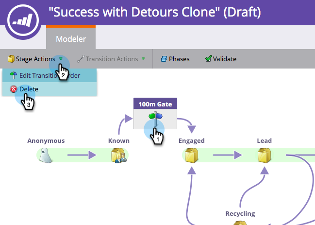

# Utilisation d’étapes SLA du modèle de revenu {#using-revenue-model-sla-stages}

SLA signifie « service level agreement ». Ces étapes sont utilisées lorsqu’il existe une durée maximale définie pendant laquelle un prospect doit être évalué ou traité avant d’avancer ou de quitter le processus.

>[!TIP]
>
>C&#39;est une excellente idée de créer un modèle pratique dans un programme graphique ou de présentation et de le confirmer avec vos collègues.

## Ajouter Une Étape SLA {#add-an-sla-stage}

1. Pour ajouter une nouvelle étape de SLA du modèle de cycle du chiffre d’affaires, cliquez sur le bouton **[!UICONTROL Analytics]** sur l’écran d’accueil de [!UICONTROL My Marketo].

   

1. Dans la section [!UICONTROL &#x200B; Analytics &#x200B;], sélectionnez votre modèle existant ou [créez-en un](/help/marketo/product-docs/reporting/revenue-cycle-analytics/revenue-cycle-models/create-a-new-revenue-model.md).

   

1. Cliquez sur **[!UICONTROL Modifier le brouillon]**.

   

1. Pour ajouter une nouvelle étape SLA, cliquez sur le bouton **[!UICONTROL SLA]**, puis faites glisser et relâchez n’importe où dans la zone de travail.

   

1. Vous pouvez modifier le **[!UICONTROL Nom]**, ajouter un **[!UICONTROL Description]** et ajuster le **[!UICONTROL Type]** après avoir ajouté une étape. Vous pouvez également sélectionner **[[!UICONTROL Démarrer le suivi par compte]](/help/marketo/product-docs/reporting/revenue-cycle-analytics/revenue-cycle-models/start-tracking-by-account-in-the-revenue-modeler.md)** à ce stade.

   

## Modification d’une étape SLA {#edit-an-sla-stage}

Lorsque vous sélectionnez une icône d’étape SLA, vous pouvez modifier le **[!UICONTROL Nom]**, ajouter un **[!UICONTROL Description]** et ajuster le **[!UICONTROL Type]**. Vous pouvez également sélectionner [[!UICONTROL Démarrer le suivi par compte]](/help/marketo/product-docs/reporting/revenue-cycle-analytics/revenue-cycle-models/start-tracking-by-account-in-the-revenue-modeler.md).

1. Cliquez sur une icône d’étape SLA.

   

1. Cliquez dans les champs **[!UICONTROL Nom]** et **[!UICONTROL Description]** pour modifier leur contenu.

   

1. Sélectionnez le menu déroulant **[!UICONTROL Type]** à modifier.

   

## Suppression D’Une Étape SLA {#delete-an-sla-stage}

1. Vous pouvez supprimer une étape SLA en cliquant avec le bouton droit ou en cliquant avec le bouton de commande sur une icône d’étape SLA.

   

1. Vous pouvez également supprimer une étape en cliquant dessus, puis dans le menu déroulant **[!UICONTROL Actions de l’étape]**, sélectionnez **[!UICONTROL Supprimer]**.

   
