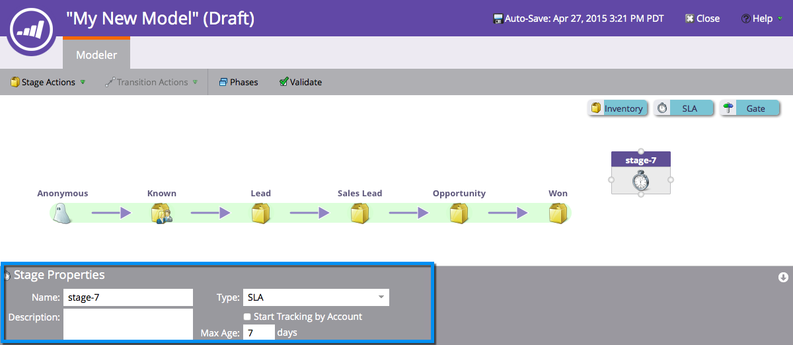

# Utilisation des étapes de l&#39;accord de niveau de service (SLA) du modèle de recettes {#using-revenue-model-sla-stages}

SLA signifie &quot;contrat de niveau de service&quot;. Ces étapes sont utilisées lorsqu&#39;il existe un délai maximal défini dans lequel une piste doit être évaluée ou traitée avant de progresser ou de sortir du processus.

>[!TIP]
>
>C&#39;est une bonne idée de créer un modèle pratique dans un programme graphique ou de présentation et de le confirmer avec vos collègues.

## Ajouter une étape SLA {#add-an-sla-stage}

1. Pour ajouter une nouvelle étape SLA de modèle de cycle de revenus, cliquez sur le bouton **Analytics** dans l’écran d’accueil Mon marketing.

   

1. Dans la section Analytics, sélectionnez votre modèle existant ou [créez-en un nouveau](create-a-new-revenue-model.md).

   

1. Cliquez sur **Modifier le brouillon**.

   

1. Pour ajouter une nouvelle étape SLA, cliquez sur le bouton **SLA** , puis faites glisser la souris et relâchez-la jusqu’à n’importe quel emplacement dans la trame.

   

1. Vous pouvez modifier le **nom**, ajouter une **description** et modifier le **type** après avoir ajouté une étape. Vous pouvez également sélectionner le suivi des [Débuts par compte](start-tracking-by-account-in-the-revenue-modeler.md)** pour le moment.

   

## Modifier une étape SLA {#edit-an-sla-stage}

Lorsque vous sélectionnez une icône d&#39;étape SLA, vous pouvez modifier le nom, ajouter une description et modifier le type. Vous pouvez également sélectionner Suivi des [Débuts par compte](start-tracking-by-account-in-the-revenue-modeler.md).

1. Cliquez sur une icône d’étape SLA.

   

1. Cliquez dans les champs **Nom** et **Description** pour modifier leur contenu.

   

1. Sélectionnez la liste déroulante **Type** à modifier.

   

## Suppression d’une étape SLA {#delete-an-sla-stage}

1. Vous pouvez supprimer une étape SLA en cliquant avec le bouton droit de la souris ou en contrôlant la sélection d&#39;une icône de l&#39;étape SLA.

   

1. Vous pouvez également supprimer une étape en cliquant dessus, puis dans la liste déroulante Actions d’étape, sélectionnez Supprimer.

   

