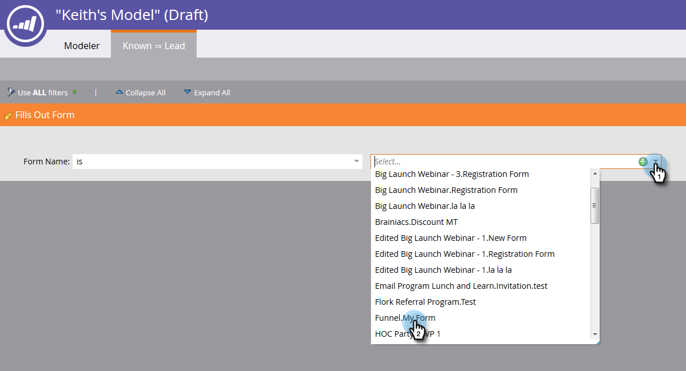

# Utilisation des Transitions de modèle de recettes {#using-revenue-model-transitions}

>[!PREREQUISITES]
>
>[Créer un modèle de recettes](create-a-new-revenue-model.md)

Lorsque vous créez votre modèle et que vous sélectionnez et organisez vos étapes d&#39;inventaire, il est temps de définir les transitions.

1. Cliquez avec le bouton droit de la souris (vous pouvez également cliquer sur l’une des flèches) pour commencer, puis sélectionnez **Modifier la Transition**.

   

   >[!NOTE]
   >
   >Les règles de transition &quot;Anonymous: Connu&quot; ne peuvent pas être modifiées.

1. Un nouvel onglet s&#39;ouvre pour la transition sélectionnée.   
1. Les transitions contrôlent comment les pistes se déplacent entre les étapes. Faites glisser le déclencheur (ou le filtre) de votre choix à droite et relâchez-le n’importe où sur la trame. Dans cet exemple, nous allons sélectionner le déclencheur Formulaire de remplissage.

   >[!TIP]
   >
   >Comme le créateur de modèles de recettes vous configure pour le rapports, il est recommandé que les transitions incluent toujours des déclencheurs. Ainsi, vos rapports refléteront la vitesse réelle de votre flux modèle/étape. Des filtres peuvent être ajoutés avec les déclencheurs pour des contraintes supplémentaires.

   

1. Sélectionnez le ou les paramètres du déclencheur/filtre sélectionné(e).

   

1. Pour revenir au modèle, cliquez sur **Modeler**.

   

1. En bas de l’écran, vous voyez maintenant les règles de transition.

   

1. Une fois que vous avez configuré des règles pour toutes vos transitions, cliquez sur **Valider** pour vérifier.

   

1. Si l’opération est effectuée correctement, le message suivant s’affiche.

   

Bien joué ! Vous avez réussi à modifier vos transitions de modèle.

>[!MORELIKETHIS]
>
>[Approbation/désapprobation d&#39;un modèle de recettes](approve-unapprove-a-revenue-model.md)
