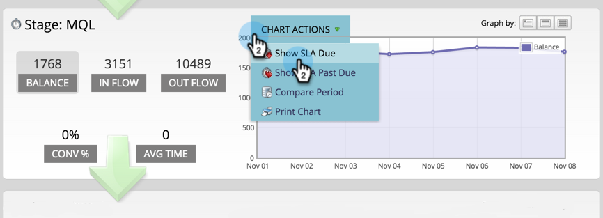

# Utilisation de l’analyseur de chemins de réussite {#using-the-success-path-analyzer}

Utilisez un analyseur de chemins de réussite pour explorer les détails spécifiques qui reflètent à la fois le flux (quantité) et la vitesse (vitesse, en termes de jours) des personnes au cours des étapes de votre [modèle de cycle de recettes](understanding-revenue-models.md).

>[!PREREQUISITES]
>
>[Création d’un analyseur de chemins de réussite](create-a-success-path-analyzer.md)

1. Accédez à **Analytics** et sélectionnez votre **Analyseur de chemin de réussite**.

   

   Le graphique à droite reflète les données du bouton sélectionné à gauche. Par défaut, il s’agit de Balance.

1. Cliquez sur **Flux** pour tracer le nombre de personnes qui sont entrées dans l’étape au cours de la période sélectionnée.

   

   * Cliquez sur Flux de sortie pour tracer le graphique du nombre de personnes qui ont quitté la scène.
   * Cliquez sur Conv % pour tracer le taux de conversion de cette étape à l’étape suivante.
   * Cliquez sur Durée moyenne pour voir combien de temps les visiteurs ont passé cette étape avant de passer à l’étape suivante.

1. Cliquez sur **Actions de graphique** > Comparer la période pour comparer les données à une autre période de même durée.

   

1. Sélectionnez la date **De** pour la période de comparaison.

   

   La date **À** est automatiquement définie pour correspondre à la durée de votre période initiale.

1. Cliquez sur **Comparer**.

   

1. Le graphique se met à jour avec des données qui se chevauchent pour la période de comparaison, en vert.

   

1. Pour modifier l’échelle de temps du graphique, cliquez sur l’un des boutons **Graphique par** : quotidien (par défaut), hebdomadaire et mensuel

   

1. Pour les étapes avec des contrats de niveau de service (contrats de niveau de service), cliquez sur **Actions du graphique** >** Afficher les contrats de niveau de service dus** pour montrer à chaque personne qui a manqué une cible de niveau de service dans le délai spécifié.

   

1. Le graphique est mis à jour pour refléter le nombre d’ALS dus sur chaque noeud, en orange.

   

   Les personnes indiquées en orange peuvent *ou ne pas* être encore dans l’étape SLA.

1. Cliquez sur **Actions de graphique** >** Afficher l&#39;échéance du contrat de niveau de service (SLA)** pour afficher toutes les personnes dont les cibles d&#39;accord de niveau de service (SLA) ont expiré et qui se trouvent encore à l&#39;étape du contrat de niveau de service (SLA) à la fin de la période spécifiée.

   

1. Le graphique est mis à jour pour refléter le nombre d’ALS en retard sur chaque noeud, en orange.

   

1. Pour lire les détails spécifiques d’un point de données sur un noeud spécifique (date), passez la souris sur la bulle.

   

1. Pour imprimer le graphique, cliquez sur** ****Actions du graphique** > **Imprimer le graphique**.

   

L&#39;analyseur est là pour vous aider à comprendre le mouvement dans votre modèle. À mesure que vous progresserez, cela deviendra très important pour la mise au point de stratégies marketing.
