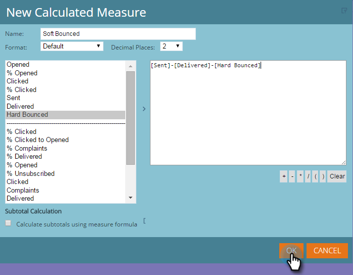
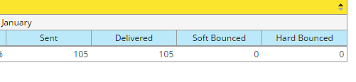

# Ajouter des mesures personnalisées à un rapport Explorateur de recettes {#adding-custom-measures-to-a-revenue-explorer-report}

Il arrive que vous souhaitiez inclure une mesure personnalisée dans un rapport. Il est facile de créer les vôtres.

Dans l’exemple ci-dessous, vous créez une mesure calculée pour les rebonds à la baisse, qui prend les mesures déjà présentes dans le rapport et utilise les calculs de base pour créer une nouvelle mesure. Vous pouvez également créer d&#39;autres types de mesures.

>[!NOTE]
>
>**Conditions préalables**
>
>Vous avez besoin d’au moins une mesure dans votre rapport, mais il n’est pas nécessaire que ce soit l’une des mesures que vous utilisez pour définir votre mesure personnalisée.

1. Placez le pointeur sur les champs dont vous avez besoin pour votre rapport. Pour plus d&#39;informations, consultez [Ajouter des champs à un rapport](adding-fields-to-a-revenue-explorer-report.md) de l&#39;Explorateur de recettes.
1. Cliquez avec le bouton droit sur une mesure existante (cellule bleue), cliquez sur Mesure **définie par l’** utilisateur et sélectionnez Mesure **** calculée.

   

1. Nommez votre mesure personnalisée et sélectionnez un format.

   

1. Cliquez sur chaque élément dont vous avez besoin à gauche et cliquez sur la flèche pour le déplacer. Ajoutez des symboles mathématiques si nécessaire.

   

   >[!TIP]
   >
   >Vous pouvez saisir les symboles mathématiques vous-même ou utiliser la zone de sélection.

1. Lorsque vous avez terminé, cliquez sur **OK**.

   

   Votre nouvelle mesure personnalisée s&#39;affiche sous la forme d&#39;une nouvelle colonne dans le rapport.

   

   >[!NOTE]
   >
   >**Articles connexes**
   >
   >    
   >    
   >    * [Ajouter des champs à un rapport Explorateur de recettes](adding-fields-to-a-revenue-explorer-report.md)

