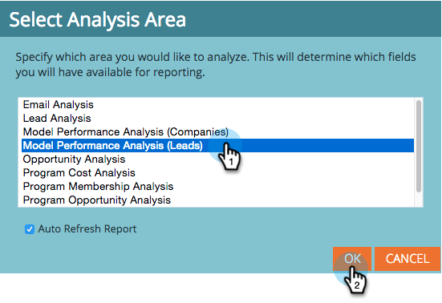
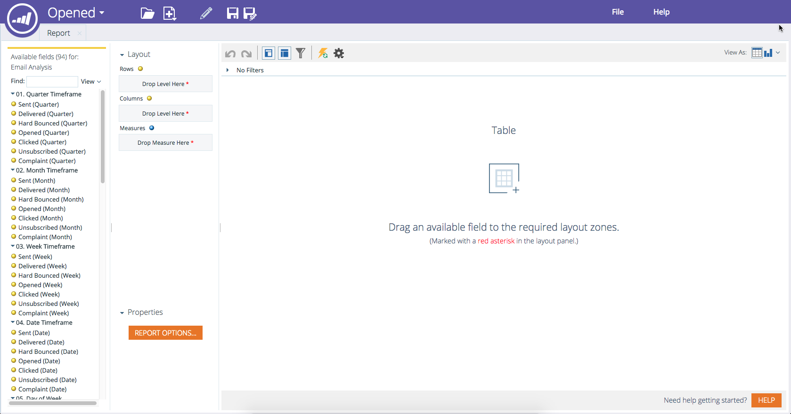

# Créer un rapport [!UICONTROL Explorateur de revenus] {#create-a-revenue-explorer-report}

Le rapport [!UICONTROL Explorateur de revenus] vous permet d’effectuer le suivi du retour sur investissement de vos initiatives marketing.

>[!AVAILABILITY]
>
>Tous les utilisateurs de Marketo Engage n’ont pas acheté cette fonctionnalité. Pour plus d’informations, contactez l’équipe du compte Adobe (votre gestionnaire de compte).

>[!IMPORTANT]
>
>Le dossier Corbeille de l’Explorateur du cycle du chiffre d’affaires a été temporairement masqué en raison d’un problème technique. Nous travaillons actuellement sur un correctif et vos fichiers sont sûrs. Veuillez contacter [l’assistance Adobe](https://nation.marketo.com/t5/support/ct-p/Support) si vous avez besoin de restaurer des fichiers.

1. Accédez à la zone **[!UICONTROL Explorateur de revenus]**.

   

1. Cliquez sur **[!UICONTROL Créer]** puis sélectionnez **[!UICONTROL Rapport]**.

   

1. Choisissez un type de rapport.

   

   Fantastique ! Vous avez officiellement créé un rapport. Il est temps de personnaliser en ajoutant des champs.

   

>[!MORELIKETHIS]
>
>* [Ajout de champs à un rapport [!UICONTROL Explorateur de revenus]](/help/marketo/product-docs/reporting/revenue-cycle-analytics/revenue-explorer/adding-fields-to-a-revenue-explorer-report.md)
>* [Ajout de mesures personnalisées à un rapport [!UICONTROL Explorateur de revenus]](/help/marketo/product-docs/reporting/revenue-cycle-analytics/revenue-explorer/adding-custom-measures-to-a-revenue-explorer-report.md)
