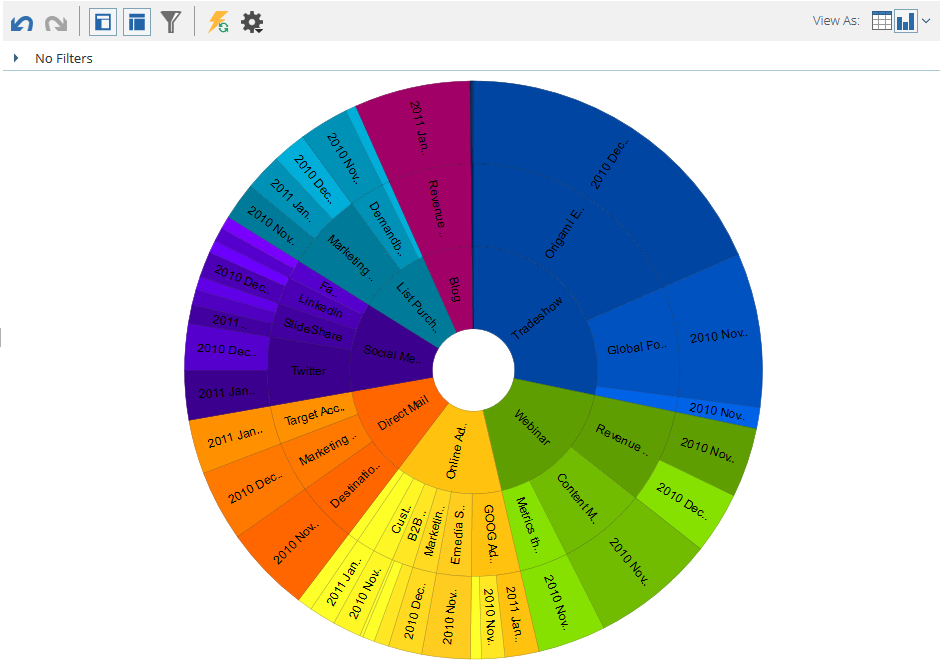

# Graphique Des Résultats À Partir De L&#39;Explorateur Des Recettes {#graphing-results-from-revenue-explorer}

Par défaut, les rapports dans l’Explorateur de recettes s’affichent sous la forme d’un tableau. Vous avez également la possibilité d’afficher les résultats sous forme de graphique dans divers formats.

1. Cliquez sur la flèche dans le menu déroulant **Vue en tant que** de votre rapport. Différentes options de graphique s’affichent.

   

## Exemples de graphiques {#graph-examples}

**Colonne**: Chaque ligne et colonne du tableau s’affiche sous la forme d’une colonne verticale.

**Colonne** empilée : Chaque ligne du tableau comporte une colonne dans le graphique.

**Colonne** empilée à 100 % : Chaque ligne du tableau comporte une colonne dans le graphique et est mise à l’échelle à 100 %.

**Ligne**: Chaque colonne est affichée sous la forme d’une ligne et chaque ligne sous la forme d’un point de données sur la ligne.

**Combo** de ligne de colonne : Combinaison de graphiques en colonnes et lignes.

**Barre**: Chaque ligne et colonne du tableau s’affiche sous la forme d’une barre horizontale.

**Graphique à barres** empilées : Chaque ligne du tableau comporte une ligne dans le graphique.

**Graphique à barres** empilées à 100 % : Chaque ligne du tableau comporte une ligne dans le graphique et est mise à l’échelle à 100 %.

**Zone**: Les données s’affichent comme une barre empilée, mais sont renseignées.

**Diagramme**: Chaque colonne est présentée sous forme de graphique circulaire, chaque ligne sous forme de tranche.

**Sunburst**: Graphique radial qui représente les attributs en tranches.

**Diagramme**: Bulles basées sur les attributs utilisés. Utilisez des mesures pour coder la bulle par couleur et/ou déterminer sa taille.

**Grille** thermique : Personnalisez les couleurs et les formes pour identifier les modèles de performances positifs et négatifs.

1. Pour revenir à la vue du tableau, cliquez sur le bouton Tableau.

   

