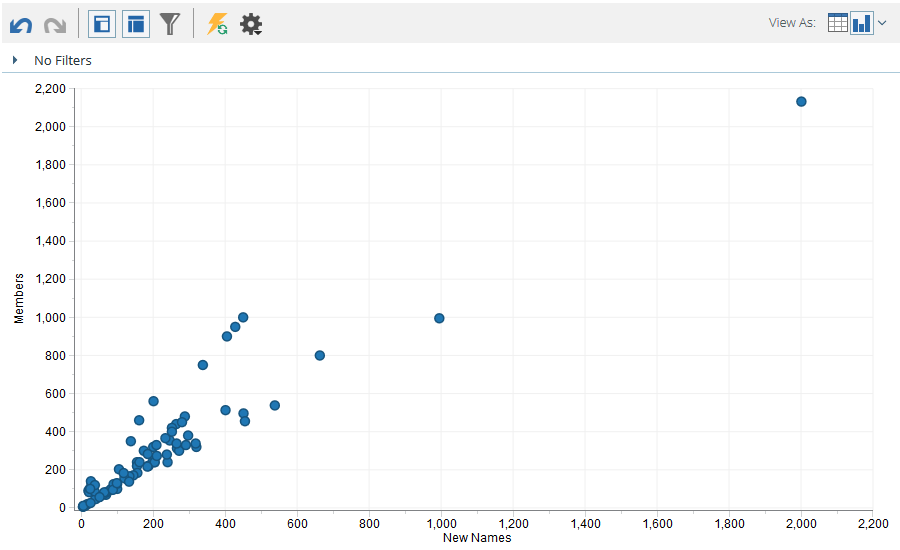

# Graphique Des Résultats De L’[!UICONTROL Explorateur De Chiffre D’Affaires] {#graphing-results-from-revenue-explorer}

Par défaut, les rapports dans [!UICONTROL Revenue Explorer] s’affichent sous la forme d’un tableau. Vous avez également la possibilité d’afficher les résultats sous forme de graphique dans divers formats.

1. Cliquez sur la flèche dans le menu déroulant **[!UICONTROL Afficher sous]** de votre rapport. Différentes options de création de graphiques s’affichent.

   

## Exemples de graphiques {#graph-examples}

**[!UICONTROL Colonne]** : chaque ligne et colonne du tableau s’affiche sous la forme d’une colonne verticale.

**[!UICONTROL Colonnes empilées]** : chaque ligne du tableau comporte une colonne dans le graphique.

**[!UICONTROL Colonne empilée à 100 %]** : chaque ligne du tableau comporte une colonne dans le graphique et est mise à l’échelle à 100 %.

**[!UICONTROL Ligne]** : chaque colonne est affichée sous la forme d’une ligne et chaque ligne sous la forme d’un point de données sur la ligne.

**[!UICONTROL Combinaison colonne-ligne]** : combinaison de graphiques [!UICONTROL colonne] et [!UICONTROL ligne].

**[!UICONTROL Barre]** : chaque ligne et colonne du tableau s’affiche sous la forme d’une barre horizontale.

**[!UICONTROL Barres empilées]** : chaque ligne du tableau comporte une ligne dans le graphique.

**[!UICONTROL Barres empilées à 100 %]** : chaque ligne du tableau comporte une ligne dans le graphique et est mise à l’échelle à 100 %.

**[!UICONTROL Zone]** : les données s’affichent de la même manière que les barres empilées, mais sont remplies.

**[!UICONTROL Secteurs]** : chaque colonne s’affiche sous la forme d’un graphique en secteurs, chaque ligne sous la forme d’une tranche.

**[!UICONTROL Sunburst]** : graphique radial qui représente les attributs en tranches.

**[!UICONTROL Dispersion]** : bulles basées sur les attributs utilisés. Utilisez des mesures pour coder la bulle par couleur et/ou déterminer sa taille.

**[!UICONTROL Grille thermique]** : personnalisez les couleurs et les formes pour identifier les modèles de performance positifs et négatifs.

1. Pour revenir à la vue Tableau, cliquez sur le bouton Tableau .

   
